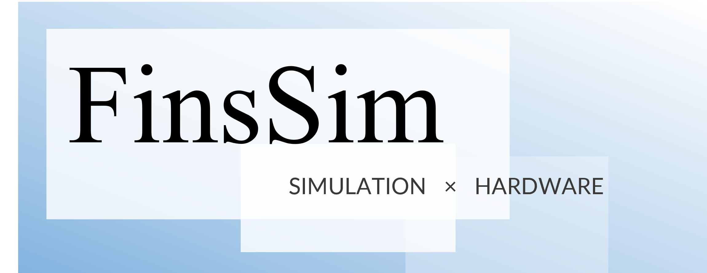

<div align="center">
  

# FinsSim

### A Reality-Aligned Integrated Simulation Platform for Underwater Robot Learning

[](https://arxiv.org/abs/2609.23943)
[](https://sherlocknolan.github.io/projects/FinsSim/)
[](LICENSE)
[](https://github.com/IWIN-FINS/FinsSim/issues)
[](https://github.com/IWIN-FINS/FinsSim/commits/main)
[](pyproject.toml)
[](CITATION.cff)

</div>

**FinsSim** is an open, end-to-end platform for underwater-robot
simulation, reinforcement learning, ROS 2 control, system identification, and
sim-to-real evaluation ([Project Page](https://sherlocknolan.github.io/projects/FinsSim/)). It keeps the control and observation contract stable
across Unity-based simulation, trained policies, ROS 2 evaluation, and the
physical vehicle.

The hardware code is mainly designed for our [FinsROV](https://github.com/IWIN-FINS/FinsROV-An-Underwater-Camera-Based-Multi-Robot-Platform), while the ROS 2 network, other perception modules
and the organized hardware architecture can be adapted to any other vehicles. We've also imported third-party models like [BlueROV2](https://github.com/CentraleNantesROV/bluerov2.git) in Unity.

> The Unity simulator is maintained in the companion
> [FinsSimUnity](https://github.com/IWIN-FINS/FinsSimUnity) repository and the Isaac Lab backend in [FinsSimIsaacLab](https://github.com/IWIN-FINS/FinsSimIsaacLab). This
> repository contains the Python, ROS 2, experiment, and integration workspace.

## Highlights

- **Fidelity-Scalable Hydrodynamics** — select simplified or calibrated
  Fossen-form dynamics and mesh-based hydrodynamics, integrate third-party
  vehicle models, and identify or replay-validate vehicle dynamics against
  recorded trials.
- **Unified Learning Workflows** — common Python/CLI entry points for control
  baselines, single-agent RL, and multi-agent RL; configuration-driven runs,
  parallel simulation, and domain-randomization tools for vehicle, actuator,
  and hydrodynamic uncertainty.
- **Reliable Sim-to-Real Transfer** — ROS 2 connects simulation, controllers,
  state estimation, and bounded thruster execution, with low-cost overhead
  refractive AprilTag localization fused with IMU and depth measurements for
  pool-scale deployment.
- **Complete Experimental Verification** — T1/T2 experiment recording,
  top-view camera capture, hydrodynamic identification, Unity–Fossen replay
  validation, and matched simulation/pool evaluation workflows.

## Repository map

```text
python/
  finssim_core/       Shared configuration, runtime, ports, and experiment utilities
  finssim_cli/        The top-level `finssim` command-line interface
  finssim_rl/         Single-agent reinforcement-learning backend
  finssim_marl/       Multi-agent reinforcement-learning backend
ros2_ws/              ROS 2 control, bridge, perception, and identification packages
configs/              Versioned experiment configurations
docs/                 Architecture, calibration, training, and validation documentation
simulators/
  unity/              Optional Unity projects
    FinsSimUnity/     Unity simulator and task definitions
  isaaclab/           Optional Isaac Lab backend and task definitions
    FinsSimIsaacLab/  Isaac Lab simulator and task definitions
```

## Release scope

This `release-candidate` branch does **not** ship the
`python/finssim_irl` inverse-reinforcement-learning package. IRL-related
material that remains under `configs/` or `docs/` is retained as development
reference only; it is not an installable, supported, or reproducible feature
of this release candidate. The source remains in the private development
line until its release plan is finalized.

## Quick start

Clone the repository, initialize only the retained third-party submodules, and
create the managed Python environment:

```bash
git clone https://github.com/IWIN-FINS/FinsSim.git
cd FinsSim
git submodule update --init --recursive
uv sync --all-packages
uv run --package finssim-cli finssim info
```

Unity and Isaac Lab is optional and is intentionally an independent repository, rather
than a submodule. To use that backend, clone a reviewed release into the
expected local path:

```bash
git clone https://github.com/IWIN-FINS/FinsSimUnity.git \
  simulators/unity/FinsSimUnity
git clone https://github.com/IWIN-FINS/FinsSimIsaacLab.git \
  simulators/isaaclab/FinsSimIsaacLab
```

Preview training commands without launching a Unity executable:

```bash
uv run --package finssim-cli finssim rl train \
  -c configs/rl/example.yaml --dry-run

uv run --package finssim-cli finssim marl train \
  -c configs/marl/example.yaml --dry-run
```

To train, set `unity.env_path` to a compatible Unity server build in the YAML
configuration, then remove `--dry-run`. See the backend and training documents
below before starting a real run.

External installations are deliberately not hard-coded. Set `ISAACLAB_PATH`,
`UNITY_EDITOR_PATH`, and (when using a separate Unity checkout)
`FINSSIM_UNITY_ROOT` in your shell or CI environment before using the matching
profiles.

## Documentation

| Topic | Entry point |
| --- | --- |
| Full documentation map | [English](docs/README.md) · [中文](docs/README.zh-CN.md) |
| Training backends | [English](docs/learning/training/rl-backends.md) · [中文](docs/learning/training/rl-backends.zh-CN.md) |
| Single-agent RL | [English](python/finssim_rl/README.md) · [中文](python/finssim_rl/README.zh-CN.md) |
| Multi-agent RL | [English](python/finssim_marl/README.md) · [中文](python/finssim_marl/README.zh-CN.md) |
| ROS 2 workspace | [ros2_ws/README.md](ros2_ws/README.md) |
| Hydrodynamic identification | [FinsROV profile identification](docs/simulation/hydrodynamics/finsrov-fossen-profile-identification_20260812.zh-CN.md) |
| Unity–Fossen validation | [Replay validator](docs/simulation/validation/unity-fossen-replay-validator.zh-CN.md) |
| Coordinate convention | [Coordinate-system audit](docs/reference/coordinate-frames/convention-audit.zh-CN.md) |
| License audit | [中文](docs/governance/license-audit.zh-CN.md) |

## Citation

If FinsSim contributes to academic work, please cite the accompanying paper.
[`CITATION.cff`](CITATION.cff) also retains the software record used by
GitHub's **Cite this repository** panel.

```bibtex
@article{zhang2026finssim,
  title   = {FinsSim: A Reality-Aligned Integrated Simulation Platform for Underwater Robot Learning},
  author  = {Zhang, Yu and Song, Yuanmingqing and Rao, Xiangyun and Fong, Pangkit and Zhang, Kunhao and Fang, Chongrong and He, Jianping},
  journal = {arXiv preprint arXiv:2609.23943},
  year    = {2026},
  doi     = {10.48550/arXiv.2609.23943},
  url     = {https://arxiv.org/abs/2609.23943}
}
```
## License and commercial terms

FinsSim-owned portions are released under the [Apache License 2.0](LICENSE).
FinsSim may also be licensed under a separate commercial agreement for support,
warranties, proprietary redistribution terms, or other rights not provided by
the public license; see [COMMERCIAL-LICENSE.md](COMMERCIAL-LICENSE.md).

The repository is **not** uniformly Apache-2.0: imported and third-party
components retain their own notices and licenses. Read
[THIRD_PARTY_NOTICES.md](THIRD_PARTY_NOTICES.md) and the component-level
license before redistributing or relicensing any part of the project.

## Contributing and support

Please use [GitHub Issues](https://github.com/IWIN-FINS/FinsSim/issues) for
bug reports and feature discussions. Before opening a change, preserve the
project's coordinate, observation/action, and thruster-order contracts; these
interfaces are shared by the simulator, controllers, training code, and
hardware bridge.

## Citation

If FinsSim contributes to academic work, please cite the accompanying paper.
[`CITATION.cff`](CITATION.cff) also retains the software record used by
GitHub’s **Cite this repository** panel.

```bibtex
@article{zhang2026finssim,
  title   = {FinsSim: A Reality-Aligned Integrated Simulation Platform for Underwater Robot Learning},
  author  = {Zhang, Yu and Song, Yuanmingqing and Rao, Xiangyun and Fong, Pangkit and Zhang, Kunhao and Fang, Chongrong and He, Jianping},
  journal = {arXiv preprint arXiv:2609.23943},
  year    = {2026},
  doi     = {10.48550/arXiv.2609.23943},
  url     = {https://arxiv.org/abs/2609.23943}
}
```

## References

We gratefully acknowledge the contributions of the following underwater
hydrodynamics, robotics-simulation, and learning platforms.  They informed the
research landscape discussed by FinsSim and the accompanying paper.  Links in
this section provide attribution only: these projects are not bundled runtime
dependencies of FinsSim, and their inclusion does not imply endorsement or
feature equivalence.

### Platforms compared in the paper

The platform-scope comparison in the paper is based on the primary publication
or software record linked below.  It reports native support described by those
sources; later external integrations may provide additional capabilities.

| Platform | Primary publication / software record | Upstream source |
| --- | --- | --- |
| UUV Simulator | [Manhaes et al., 2016](https://doi.org/10.1109/OCEANS.2016.7761080) | [GitHub](https://github.com/uuvsimulator/uuv_simulator) |
| DAVE | [Zhang et al., 2022](https://doi.org/10.1109/AUV53081.2022.9965808) | [GitHub](https://github.com/Field-Robotics-Lab/dave) |
| HoloOcean | [Romrell et al., 2025](https://arxiv.org/abs/2510.06160) | [Bitbucket](https://bitbucket.org/frostlab/holoocean) |
| Stonefish | [Grimaldi et al., 2025](https://doi.org/10.1109/ICRA55743.2025.11127421) | [GitHub](https://github.com/patrykcieslak/stonefish) |
| MARUS | [Loncar et al., 2022](https://doi.org/10.1109/OCEANS47191.2022.9976969) | [GitHub](https://github.com/MARUSimulator/marus-example) |
| MarineGym | [Chu et al., 2025](https://arxiv.org/abs/2503.09203) | [GitHub](https://github.com/Marine-RL/MarineGym) |
| UNav-Sim | [Amer et al., 2023](https://doi.org/10.1109/ICAR58858.2023.10406819) | [GitHub](https://github.com/open-airlab/UNav-Sim) |
| Orca | [orca4 software record](https://github.com/clydemcqueen/orca4) / [orca5 software record](https://github.com/clydemcqueen/orca5) | [orca4](https://github.com/clydemcqueen/orca4) / [orca5](https://github.com/clydemcqueen/orca5) |

### Additional local research references

The following projects are maintained as source checkouts in the local
research-reference workspace.  DAVE, HoloOcean, UNav-Sim, MarineGym,
Stonefish, and Orca are already listed above; the remaining checkouts and their
upstream-supplied references are recorded here for complete attribution.

| Project | Publication / reference | Upstream source |
| --- | --- | --- |
| Gazebo Sim (`gz-sim`) | Simulation-engine source; no project-specific paper is asserted here. | [GitHub](https://github.com/gazebosim/gz-sim) |
| BlueROV2 Gym | [Puthumanaillam et al., 2024, *TAB-Fields*](https://arxiv.org/abs/2412.02570) | [GitHub](https://github.com/gokulp01/bluerov2_gym) |
| Isaac AUV Environment | [Cai, Chang, and Girdhar, 2025, *Learning to Swim*](https://arxiv.org/abs/2410.00120) | [GitHub](https://github.com/warplab/isaac-auv-env) |
| URSim | [Katara et al., 2019](https://doi.org/10.1109/UT.2019.8734309) | [GitHub](https://github.com/srmauvsoftware/URSim) |
| SafeRLAUV | [*Aquatic Navigation: A Challenging Benchmark for Deep Reinforcement Learning* (RLC 2024)](https://rlj.cs.umass.edu/2024/papers/Paper131.html) | [GitHub](https://github.com/dadecampo/SafeRLAUV) |
| RLforUTracking | Source implementation; its checkout does not provide a stable project-specific publication record. | [GitHub](https://github.com/imasmitja/RLforUTracking) |
