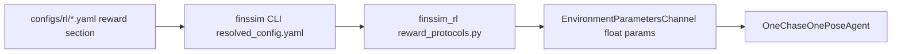

# 1Chase1 Reward Protocol v1

`1Chase1` 的 reward 配置分两层：

1. 训练 YAML 面向人，使用字符串，例如 `reward.mode: distance_only`。
2. ML-Agents `EnvironmentParametersChannel` 只能发送 `float`，所以 Python 启动时会把字符串编译为 Unity 可读的数值参数。

协议文件是单一真相源：

```text
configs/reward_protocols/one_chase_one_reward_v1.yaml
```

## 启动流程



Python 会检查：

- `reward.protocol` 是否存在
- `reward.mode` 是否在协议表中
- `reward.parameters` 是否都是协议允许的字段
- 所有参数是否为数值

Unity 会检查：

- `finsim_1c1.reward.protocol_version` 是否等于当前支持版本
- `finsim_1c1.reward.mode` 对应的 reward 模式

## Reward Mode 编号

当前 `one_chase_one_reward_v1`：

| YAML 字符串 | Unity 编号 | 语义 |
|---|---:|---|
| `dense_chase` | `0` | 原本 dense reward：距离进展、距离、朝向、接近速度、近捕获 bonus |
| `distance_only` | `1` | 只奖励当前距离越近越好，捕获成功条件不变 |
| `distance_plus_subgoal` | `2` | 距离奖励 + 鼓励 PPO 高层目标点靠近 prey |
| `sparse_capture` | `3` | 只保留稀疏捕获/超时/越界和轻量动作惩罚 |

训练 YAML 不应该直接写编号，应该写字符串：

```yaml
reward:
  protocol: one_chase_one_reward_v1
  mode: distance_plus_subgoal
  parameters:
    distance_scale: 0.08
    subgoal_to_prey_scale: 0.04
```

## 高层 Subgoal Reward

`distance_plus_subgoal` 会使用 PPO 输出的 body-frame 局部目标点。

Python `HierarchyChaseModel` 在 rollout/eval 中把高层动作通过 side channel 发给 Unity；Unity 的 `OneChaseOnePoseAgent` 比较：

```text
high_level_target_debug_local_delta
vs
clamp(fish_relative_position_body, subgoal_to_prey_range)
```

奖励为：

```text
subgoal_to_prey_scale * clamp01(1 - error / subgoal_to_prey_range)
```

如果 side channel 超时，`subgoal_fresh=false`，该项为 `0`。

## 推荐实验入口

距离奖励：

```bash
uv run --package finssim-cli finssim rl train -c configs/rl/1chase1/hierarchy/distance_only.yaml
```

距离 + 高层目标点奖励：

```bash
uv run --package finssim-cli finssim rl train -c configs/rl/1chase1/hierarchy/distance_plus_subgoal.yaml
```

调参时优先改对应 YAML 的 `reward.parameters`，不要改 Unity C# 里的默认值。
