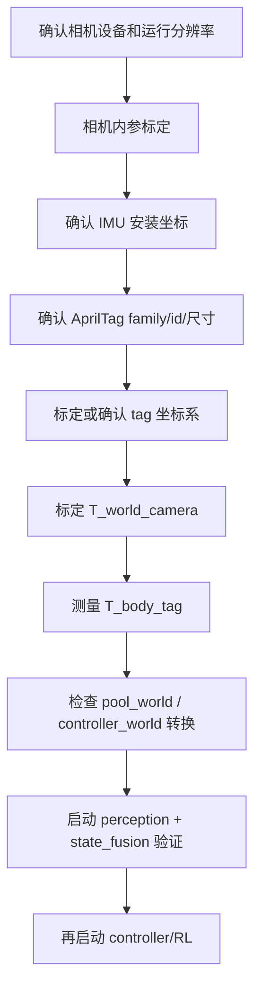

# FinsROV 标定总入口

本文是 FinsSim/FinsROV 实船标定的统一入口。标定相关细节分散在 `ros2_ws/README.md`、`perception`、`state_estimation` 和顶层坐标系文档中；以后现场标定先从这里开始，再跳转到包内工具文档。

## 1. 标定顺序

推荐按下面顺序执行，不要先调 EKF 或 PID：



## 2. 每一步产物

| 步骤 | 产物 | 写入位置 | 主文档 |
| --- | --- | --- | --- |
| 相机设备确认 | `/dev/v4l/by-id/...`、width、height、fps、fourcc | 相机 launch/config | [camera-intrinsics.zh-CN.md](camera-intrinsics.zh-CN.md) |
| 相机内参 | `camera_matrix`、`distortion_coefficients` | `ros2_ws/src/perception/calibration/*.yaml` 或 native config 引用的 calibration 文件 | [camera-intrinsics.zh-CN.md](camera-intrinsics.zh-CN.md) |
| AprilTag 基础参数 | `tag_family`、`tag_id`、`marker_length_m` | perception/native config | [apriltag-and-homography.zh-CN.md](apriltag-and-homography.zh-CN.md) |
| 旧 2D 平面定位 | `pool_homography.yaml` | `ros2_ws/src/perception/calibration/pool_homography.yaml` | [apriltag-and-homography.zh-CN.md](apriltag-and-homography.zh-CN.md) |
| 固定相机外参 | `T_world_camera` | `ros2_ws/src/state_estimation/config/state_fusion_extrinsics.yaml` | [world-camera-extrinsic.zh-CN.md](world-camera-extrinsic.zh-CN.md) |
| tag 到潜器外参 | `T_body_tag.<id>` | `ros2_ws/src/state_estimation/config/state_fusion_extrinsics.yaml` | [tag-body-extrinsic.zh-CN.md](tag-body-extrinsic.zh-CN.md) |
| IMU 安装外参 | `imu_sensor_to_base_quaternion_xyzw` | hardware bridge YAML | [imu-coordinate-calibration.zh-CN.md](imu-coordinate-calibration.zh-CN.md) |
| 坐标系统一 | `pool_world`、`controller_world`、body/camera/tag frame 约定 | `pool_world.yaml`、controller basis config | [coordinate-system.zh-CN.md](coordinate-system.zh-CN.md) |
| 验收 | `/finsrov/pose`、`/finsrov/state/status`、controller observation 正常 | 无 | [validation-checklist.zh-CN.md](validation-checklist.zh-CN.md) |

## 3. 当前主链路和旧链路

实船主链路使用 native C++ AprilTag + 折射/约束位姿 + state fusion：

```text
camera
  -> perception
  -> /finsrov/vision/refracted_pose_6d
  -> state_estimation
  -> /finsrov/pose, /finsrov/imu_link, /finsrov/depth_link, /finsrov/dvl_link
  -> controller_state_adapter / motion_controller
```

旧 Python perception 和 homography 仍可用于调试：

```text
camera_capture/apriltag_tracker
  -> /finsrov/vision/status 中的 pixel/world_xy debug 字段
```

不要把旧 `pool_homography.yaml` 当作当前 6D 实船融合主源。当前 6D 主链路依赖：

```text
相机内参 + tag 尺寸 + T_world_camera + T_body_tag + depth + IMU
```

## 4. 常用启动命令

从 `ros2_ws` 执行：

```bash
cd ./ros2_ws
```

查看相机设备：

```bash
v4l2-ctl --list-devices
v4l2-ctl -d /dev/video0 --list-formats-ext
```

扫描 tag family/id：

```bash
./scripts/run_ros2_uv.sh ros2 run perception scan_fiducial_tags --help
```

启动 native AprilTag：

```bash
./scripts/run_ros2_uv.sh ros2 launch perception direct_apriltag_ir.launch.py
```

启动 PyQt6 monitor：

```bash
./scripts/run_ros2_uv.sh ros2 run perception perception_monitor
```

标定 `T_world_camera`：

```bash
./scripts/run_ros2_uv.sh ros2 run state_estimation calibrate_world_camera --help
```

启动融合：

```bash
./scripts/run_ros2_uv.sh ros2 launch state_estimation state_fusion.launch.py
```

验证：

```bash
./scripts/run_ros2_uv.sh ros2 topic echo /finsrov/vision/refracted/status --once --full-length
./scripts/run_ros2_uv.sh ros2 topic echo /finsrov/state/status --once --full-length
./scripts/run_ros2_uv.sh ros2 topic echo /finsrov/pose --once --full-length
```

## 5. 包内详细文档

保留在包内的文档是工具/实现细节，不再作为现场标定总入口：

```text
ros2_ws/src/perception/docs/rgb_camera_apriltag_calibration.zh-CN.md
ros2_ws/src/perception/README.zh-CN.md
ros2_ws/src/perception/docs/refractive_apriltag_pose_algorithm.zh-CN.md
ros2_ws/src/state_estimation/docs/world_camera_extrinsic_calibration.zh-CN.md
ros2_ws/src/state_estimation/docs/t_body_tag_extrinsic.zh-CN.md
ros2_ws/src/state_estimation/docs/refractive_apriltag_fusion_algorithm.zh-CN.md
ros2_ws/src/state_estimation/docs/state_fusion_refractive_6d.zh-CN.md
ros2_ws/src/state_estimation/docs/fusion_pipeline.zh-CN.md
```

顶层坐标系审计文档：

```text
docs/coordinate_system_unification_zh-CN.md
docs/coordinate_convention_audit_zh-CN.md
```
