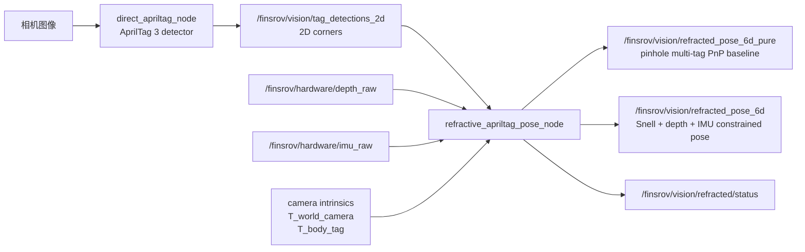

# AprilTag 折射 6D 定位算法说明

标定总入口见：

```text
docs/calibration/index.zh-CN.md
```

本文聚焦 `perception` 的折射/约束位姿算法；现场标定顺序和各标定产物从顶层入口开始看。

本文档说明 `perception` 中 `refractive_apriltag_pose_node` 的两路 6D 位姿输出。先把一个容易混淆的点说清楚：

```text
当前已经实现的两路输出是：

1. /finsrov/vision/refracted_pose_6d_pure
   纯视觉 debug/baseline，但它是普通 pinhole multi-tag PnP，不是 Snell 折射模型。

2. /finsrov/vision/refracted_pose_6d
   混合约束 Snell 模型：AprilTag 角点 + 水压计深度 + IMU roll/pitch + Snell 折射。
```

所以如果说“纯视觉 Snell”和“混合 + Snell”两套方案，当前代码只完整实现了第二套。第一套“纯视觉 Snell”在数学上可以做，但还没有实现成发布 topic；目前的 `pure` topic 是为了和普通相机模型做对照。

源码位置：

```text
ros2_ws/src/perception/src/refractive_apriltag_pose_node.cpp
```

配置文件：

```text
ros2_ws/src/perception/config/refractive_apriltag_ir.yaml
ros2_ws/src/perception/config/refractive_apriltag_rgb.yaml
```

## 1. 总体数据流



`direct_apriltag_node` 不发布高频 `image_raw`，而是只把检测到的 tag 角点发布出来：

```text
/finsrov/vision/tag_detections_2d
```

每个 detection 包含：

```text
tag_id
family
hamming
decision_margin
center_px
corner_pixels_xy[4]
mean_edge_px
```

## 2. 坐标系和外参

本文使用：

```text
T_A_B
```

表示把 B 坐标系下的点变换到 A 坐标系。

主要坐标系：

```text
camera frame:
  相机坐标系，像素反投影先在这里得到空气中视线。

pool_world:
  ROS 世界坐标，右手系，z-up，z=0 为水池中心底部，水面为 z=water_surface_z_m。

finsrov_base_link:
  潜器 ROS body frame。最终发布的是 body 在 pool_world 下的位姿。
  轴定义为 ROS FLU: x forward, y left, z up。

tag frame:
  每个 AprilTag 自己的坐标系。
```

外参文件：

```text
ros2_ws/src/state_estimation/config/state_fusion_extrinsics.yaml
```

关键字段：

```yaml
T_world_camera:
  translation_xyz: [...]
  rotation_xyzw: [...]

T_body_tag:
  4:
    translation_xyz: [...]
    rotation_rpy_deg: [...]
```

`T_body_tag` 的完整填写说明见：

```text
ros2_ws/src/state_estimation/docs/t_body_tag_extrinsic.zh-CN.md
```

`T_body_tag` 的语义是：

```text
tag 点 -> body frame
p_body = T_body_tag * p_tag
```

这是唯一允许写入配置文件的 tag 外参。`translation_xyz` 就是 tag 中心在 `finsrov_base_link` 下的位置，`rotation_rpy_deg` 是 tag frame 相对 body frame 的姿态。

旧字段 `T_tag_body` 已废弃且禁止使用。如果配置文件中出现 `T_tag_body`，节点会直接启动失败。

旧 pinhole PnP 需要 body 在 tag 下的反向外参时，代码会内部取逆：

```text
T_tag_body = inverse(T_body_tag)
```

然后把 tag 四个角点变换成 body frame 下的 3D 点。

## 3. 每个 tag 角点的 3D 样本构造

设 tag 编码区域边长为：

```text
L = marker_length_m
h = L / 2
```

tag frame 下四个角点按 OpenCV marker 顺序定义为：

```text
p_tag[0] = [-h, +h, 0]
p_tag[1] = [+h, +h, 0]
p_tag[2] = [+h, -h, 0]
p_tag[3] = [-h, -h, 0]
```

对每个已知外参的 tag：

```text
p_body[i] = T_body_tag * p_tag[i]
```

这样一帧中检测到 N 个 tag 时，会得到：

```text
4N 个 3D body 点 p_body[i]
4N 个对应像素点 u[i]
```

这些点会同时用于两路估计。

## 4. 输出 A：纯视觉 pinhole multi-tag PnP baseline

Topic：

```text
/finsrov/vision/refracted_pose_6d_pure
```

注意：这个名字里带 `refracted` 是因为它由同一个节点发布，但算法本身不是 Snell 折射模型。

### 4.1 输入

```text
p_body[i]        已知 body frame 下的 tag 角点 3D 坐标
u[i]             对应像素角点
K, distortion    相机内参和畸变
T_world_camera   相机到 pool_world 的外参
```

### 4.2 求解

调用 OpenCV：

```cpp
cv::solvePnP(
  object_points = p_body[i],
  image_points  = u[i],
  camera_matrix = K,
  dist_coeffs   = distortion,
  flags         = cv::SOLVEPNP_ITERATIVE
)
```

得到：

```text
T_camera_body
```

再转换到世界系：

```text
T_world_body = T_world_camera * T_camera_body
```

### 4.3 输出

```text
position    = t_world_body
orientation = R_world_body
```

协方差使用配置：

```yaml
pure_covariance_xyz: 0.05
pure_covariance_rpy: 0.20
```

状态字段：

```json
{
  "pure_visual_valid": true,
  "pure_visual_model": "pinhole_multi_tag_baseline",
  "pure_visual_reprojection_error_px": ...
}
```

### 4.4 适用场景和限制

适用：

```text
空气中标定和调试
水面折射影响很小时的粗略对照
检查 tag 外参、tag 顺序、相机内参是否大致正确
```

不适用：

```text
相机在空气中、tag 在水下，中间存在明显水面折射
需要把水压计 z 作为强约束的实船闭环控制
```

因此这一路不应该作为实船融合的主输入。

## 5. 输出 B：混合约束 Snell 6D pose

Topic：

```text
/finsrov/vision/refracted_pose_6d
```

这是当前实船推荐主输出。

### 5.1 输入

```text
p_body[i]          body frame 下的 tag 角点 3D 坐标
u[i]               对应像素角点
K, distortion      相机内参和畸变
T_world_camera     相机到 pool_world 的外参
depth_raw          水压计深度
IMU quaternion     roll/pitch/yaw 初值
n_air, n_water     空气和水的折射率
water plane        水面平面
```

当前默认：

```yaml
n_air: 1.0003
n_water: 1.333
water_surface_z_m: 0.98
water_plane_normal: [0.0, 0.0, 1.0]
depth_sign: -1.0
pressure_sensor_offset_z_body: -0.115
```

水面平面写作：

```text
n^T X + d = 0
```

默认就是：

```text
z = water_surface_z_m
```

水压计深度转换为 ROS z-up：

```text
sensor_z = water_surface_z_m + depth_sign * depth_raw.z
offset_world_z = pressure_sensor_offset_z_body * cos(roll) * cos(pitch)
z_body = sensor_z - offset_world_z
```

若硬件深度向下为正，`depth_sign=-1`，且水压计在 body 原点下方 0.115 m：

```text
depth_raw.z = +0.98
water_surface_z_m = 0.98
sensor_z = 0.0
z_body = 0.115   # 水平姿态，body 原点在水压计上方 0.115 m
```

### 5.2 为什么只优化 [x, y, yaw]

完整 6D pose 是：

```text
[x, y, z, roll, pitch, yaw]
```

当前混合约束算法把其中三个量交给传感器强约束：

```text
z      = pressure depth corrected to body origin
roll   = IMU roll
pitch  = IMU pitch
```

优化变量只保留：

```text
s = [x, y, yaw]^T
```

这样做的原因是：

```text
1. 水压计的深度通常比单目视觉的 z 稳定。
2. IMU 的 roll/pitch 高频且短时稳定。
3. 俯视相机下，x/y/yaw 是 AprilTag 最容易约束的自由度。
4. 降低优化维度，实时性和鲁棒性更好。
```

最终输出仍然是 6D：

```text
position    = [x_opt, y_opt, z_body]
orientation = quat(roll_imu, pitch_imu, yaw_opt)
```

### 5.3 像素点的 Snell 反投影

对每个像素点 `u=[u,v]`：

1. 用相机内参和畸变模型去畸变：

```text
u -> normalized camera point [x_n, y_n]
```

2. 得到相机坐标系中的单位视线：

```text
r_camera = normalize([x_n, y_n, 1])
```

3. 转到世界系空气侧视线：

```text
r_air = R_world_camera * r_camera
C     = t_world_camera
```

4. 与水面平面求交点：

```text
s_surface = -(n^T C + d) / (n^T r_air)
P_surface = C + s_surface * r_air
```

如果：

```text
s_surface <= 0
```

说明视线没有向前打到水面，该角点无效。

5. 按 Snell 定律计算水中折射方向。

设：

```text
eta = n_air / n_water
cos_i = -n_incident^T r_air
k = 1 - eta^2 * (1 - cos_i^2)
```

若：

```text
k < 0
```

表示发生全反射或几何无效，该角点无效。

水中方向：

```text
r_water =
  normalize(
    eta * r_air
    + (eta * cos_i - sqrt(k)) * n_incident
  )
```

6. 与目标深度平面 `z = z_target` 求交：

```text
lambda = (z_target - P_surface.z) / r_water.z
Q = P_surface + lambda * r_water
```

这里的 `Q` 是：该像素角点在指定世界 z 平面上的折射反投影 3D 点。

### 5.4 残差构造

给定优化状态：

```text
s = [x, y, yaw]
```

用 IMU roll/pitch 和当前 yaw 构造旋转：

```text
R_world_body = Rz(yaw) * Ry(pitch_imu) * Rx(roll_imu)
```

body 原点：

```text
O = [x, y, z_body]
```

对每个 body 角点：

```text
P_i(s) = O + R_world_body * p_body[i]
```

它的当前预测世界 z：

```text
z_i = P_i.z
```

把对应像素 `u_i` 通过 Snell 模型反投影到 `z=z_i` 平面：

```text
Q_i = refract_pixel_to_world_at_z(u_i, z_i)
```

残差：

```text
r_i(s) = Q_i - P_i(s)
```

整帧优化最小化：

```text
min_{x,y,yaw} sum_i ||Q_i - P_i(x,y,yaw)||^2
```

### 5.5 初值

yaw 初值来自 IMU yaw：

```text
yaw_0 = yaw_imu
```

用 `roll_imu, pitch_imu, yaw_0` 先计算每个角点相对 body 原点的偏移：

```text
offset_i = R(roll_imu, pitch_imu, yaw_0) * p_body[i]
```

预测角点深度：

```text
z_i = z_depth + offset_i.z
```

用 Snell 模型把像素反投影到 `z_i`：

```text
Q_i = refract_pixel_to_world_at_z(u_i, z_i)
```

估计 body 原点的 x/y：

```text
x_0 = mean_i(Q_i.x - offset_i.x)
y_0 = mean_i(Q_i.y - offset_i.y)
```

### 5.6 优化方法

当前实现是轻量级 Levenberg-Marquardt 风格迭代：

```text
state: [x, y, yaw]
max_iterations: 默认 8
Jacobian: 有限差分
damping lambda: 自适应增减
```

有限差分步长：

```text
dx   = 1e-4 m
dy   = 1e-4 m
dyaw = 1e-5 rad
```

线性系统：

```text
(J^T J + lambda I) delta = -J^T r
```

如果新 cost 更低：

```text
state = state + delta
lambda *= 0.5
```

否则：

```text
lambda *= 5.0
```

停止条件：

```text
|dx|   < 1e-5
|dy|   < 1e-5
|dyaw| < 1e-6
```

### 5.7 有效性检查

最终残差 RMS：

```text
residual_m = sqrt(mean(r_i^2))
```

归一化残差：

```text
error_ratio = residual_m / marker_length_m
```

如果：

```text
error_ratio > max_geometry_error_ratio
```

则拒绝该帧：

```text
constrained_valid = false
constrained_reject_reason = "geometry_error"
```

默认：

```yaml
max_geometry_error_ratio: 0.20
low_confidence_geometry_error_ratio: 0.08
```

如果超过 `low_confidence_geometry_error_ratio` 但没有超过最大门限，仍发布位姿，但协方差放大 10 倍。

### 5.8 模式切换

算法默认根据“水压计 + tag 安装外参”分三种状态。也就是说，不是只看水压计深度，而是：

```text
body_z = pressure depth corrected to body origin
tag_corner_z = body_z + R_world_body(roll, pitch, yaw) * p_body_tag_corner
```

其中 `p_body_tag_corner` 来自 `T_body_tag` 和 tag 角点尺寸。这样水压计已经在水下、但顶部 AprilTag 仍在水面/空气中时，视觉模式会切到 air 或 surface-transition。

状态分为：

```text
missing_depth:
  没有深度，不发布 constrained pose。

air:
  tag 角点高度处于水面以上或接近水面以上。
  发布 pinhole multi-tag PnP 到主视觉 topic，不使用水下 Snell 约束。

surface_transition:
  tag 角点接近水面。
  默认发布 pinhole multi-tag PnP 到主视觉 topic，避免 fusion 因水面过渡直接 hold。

underwater_refraction:
  tag 角点明确在水下。
  优先使用 Snell + depth + IMU 混合约束。
```

默认：

```yaml
mode_selection_source: tag_height
air_depth_threshold_m: 0.02
underwater_depth_threshold_m: 0.08
air_tag_margin_m: 0.01
surface_tag_transition_margin_m: 0.04
underwater_tag_margin_m: 0.02
```

如果把 `mode_selection_source` 改为 `depth`，会恢复旧逻辑：只按水压计深度选择模式。

代码里：

```text
/finsrov/vision/refracted_pose_6d 是给 fusion 使用的主视觉 pose：

mode == air:
  发布 pinhole multi-tag PnP 结果，不带入折射模型。

mode == surface_transition:
  默认也发布 pinhole multi-tag PnP 结果，保证 fusion 可以持续运行；
  如果现场认为水面附近畸变太大，可以关闭
  publish_surface_transition_pose_on_constrained_topic。

mode == underwater_refraction:
  可见 tag 数 >= min_visible_tags 时，尝试发布 Snell + depth + IMU 混合约束结果。
  如果 Snell 因 `no_valid_refracted_rays` 或 `geometry_error` 失败，且普通 PnP 重投影误差小于
  `pinhole_fallback_max_reprojection_error_px`，默认仍发布 pinhole fallback，status 中标记
  `fallback_used=true`。
```

也就是说，这个 topic 名字里带 `refracted` 是历史命名；现在它的语义是“当前最佳可融合视觉 6D pose”。status 里的 `constrained_output_model` 会说明当前实际模型是 `pinhole_air` 还是 `snell_depth_imu`。

但是 `/finsrov/vision/refracted_pose_6d_pure` 不依赖 depth/IMU，只要 PnP 成功就会发布。

## 6. 两路输出的对比

| 项目 | `refracted_pose_6d_pure` | `refracted_pose_6d` |
|---|---|---|
| 当前实现 | 普通 pinhole multi-tag PnP | Snell + depth + IMU 混合约束 |
| 是否使用 Snell | 否 | 是 |
| 是否使用水压计 | 否 | 是，强约束 z |
| 是否使用 IMU | 否 | 是，强约束 roll/pitch，yaw 初值 |
| 优化变量 | OpenCV PnP 的 6D pose | `[x, y, yaw]` |
| 输出坐标系 | `pool_world` | `pool_world` |
| 水下折射补偿 | 无 | 有 |
| 用途 | debug / baseline / sanity check | 实船主视觉输入 |
| 默认进入 EKF | 否 | 是 |

## 7. 为什么还没有“纯视觉 Snell”

所谓“纯视觉 Snell”通常指：

```text
只使用相机 + AprilTag 角点 + 折射模型，
不使用水压计 depth，
不使用 IMU roll/pitch，
直接优化完整 6D pose。
```

数学上可以写成：

```text
state = [x, y, z, roll, pitch, yaw]
P_i(state) = T_world_body(state) * p_body[i]
Q_i = refract_pixel_to_world_at_z(u_i, P_i.z)
min_state sum_i ||Q_i - P_i(state)||^2
```

但它比当前混合约束版本更难稳定：

```text
1. 单目 + 平水面折射会引入更强的几何耦合。
2. z、roll、pitch、yaw 之间会互相补偿，容易出现局部最小。
3. 水面微小波动会直接影响深度和姿态。
4. 单个 tag 的角点数量少，多 tag 外参稍有误差会让 6D 优化偏移。
```

因此当前第一版选择了更适合实船闭环的混合约束：

```text
z      交给水压计
roll   交给 IMU
pitch  交给 IMU
x/y/yaw 由 AprilTag + Snell 几何优化
```

如果后续要实现“纯视觉 Snell”，建议不要替换当前主链路，而是新增第三路 debug topic：

```text
/finsrov/vision/refracted_pose_6d_visual_only
```

并在 status 中明确：

```json
{
  "visual_only_valid": true,
  "visual_only_model": "snell_full_6d",
  "visual_only_residual_m": ...
}
```

## 8. 参数调节建议

### 8.1 折射率

默认：

```yaml
n_air: 1.0003
n_water: 1.333
```

如果水温、盐度变化不大，第一版不用频繁调。

### 8.2 水面平面

默认：

```yaml
water_surface_z_m: 0.98
water_plane_normal: [0.0, 0.0, 1.0]
```

表示水面为：

```text
z = water_surface_z_m
```

默认配置不需要手写 `water_plane_d`，节点会使用 `water_plane_d=-water_surface_z_m`。平面方程是：

```text
n^T X + d = 0
```

例如水面在 `z = 1.0`：

```text
[0,0,1]^T X + d = 0
d = -1.0
```

### 8.3 几何残差门限

默认：

```yaml
low_confidence_geometry_error_ratio: 0.08
max_geometry_error_ratio: 0.20
```

假设 tag 边长 `0.098 m`：

```text
低置信阈值约 7.8 mm
拒绝阈值约 19.6 mm
```

如果实测稳定但总是 `geometry_error`，优先检查：

```text
1. marker_length_m 是否是编码黑白区域边长，而不是纸张外框边长。
2. T_world_camera 是否准确。
3. T_body_tag 是否准确。
4. depth_sign 是否正确。
5. 水面是否明显起伏。
```

确认这些都没问题后，再放宽 `max_geometry_error_ratio`。

### 8.4 水面过渡区

默认：

```yaml
air_depth_threshold_m: 0.02
underwater_depth_threshold_m: 0.08
```

如果潜器经常在刚入水附近工作，建议保持较保守，不要让算法在水面附近强行输出 Snell pose。水面附近最容易出现：

```text
气泡
波纹
半浸没
tag 一部分在水上一部分在水下
```

这种情况下折射模型不再满足“单一平水面 + 点在水下”的假设。

## 9. 调试命令

启动红外链路：

```bash
cd ros2_ws
./scripts/run_ros2_uv.sh ros2 launch perception refractive_apriltag_ir.launch.py
```

查看 2D 检测：

```bash
./scripts/run_ros2_uv.sh ros2 topic echo /finsrov/vision/tag_detections_2d --once --full-length
```

查看混合 Snell 输出：

```bash
./scripts/run_ros2_uv.sh ros2 topic echo /finsrov/vision/refracted_pose_6d --once
```

查看普通 PnP baseline：

```bash
./scripts/run_ros2_uv.sh ros2 topic echo /finsrov/vision/refracted_pose_6d_pure --once
```

查看状态：

```bash
./scripts/run_ros2_uv.sh ros2 topic echo /finsrov/vision/refracted/status --once --full-length
```

重点字段：

```text
mode
visible_tag_ids
constrained_valid
constrained_residual_m
constrained_iterations
constrained_reject_reason
pure_visual_valid
pure_visual_reprojection_error_px
pressure_sensor_z
body_depth_z
pressure_sensor_offset_z_body
imu_used
processing_time_ms
```

## 10. 常见问题

### 10.1 `pure_visual_valid=true` 但 `constrained_valid=false`

常见原因：

```text
普通 PnP 不需要 depth/IMU/Snell，所以能成功；
混合 Snell 需要 depth 和 IMU，而且只在 underwater_refraction 模式发布。
```

检查：

```bash
./scripts/run_ros2_uv.sh ros2 topic echo /finsrov/hardware/depth_raw --once
./scripts/run_ros2_uv.sh ros2 topic echo /finsrov/hardware/imu_raw --once
```

### 10.2 `constrained_reject_reason=geometry_error`

说明 Snell 反投影点和 body 角点几何无法一致。优先检查：

```text
marker_length_m
T_world_camera
T_body_tag
depth_sign
tag corner 顺序
水面是否平
```

### 10.3 `mode=air` 或 `mode=surface_transition`

说明深度太小，节点故意不发布水下 Snell pose。这是安全策略，不是 bug。

### 10.4 多 tag 时位置跳

当前混合 Snell 优化会把所有已知 tag 的角点放在同一个 least-squares 里。如果某个 tag 的 `T_body_tag` 标错，会把整帧拉偏。

排查方法：

```text
1. 临时把 target_tag_ids 改成单个 tag。
2. 分别测试每个 tag 的 constrained_residual_m。
3. 找到残差明显异常的 tag 外参。
```
