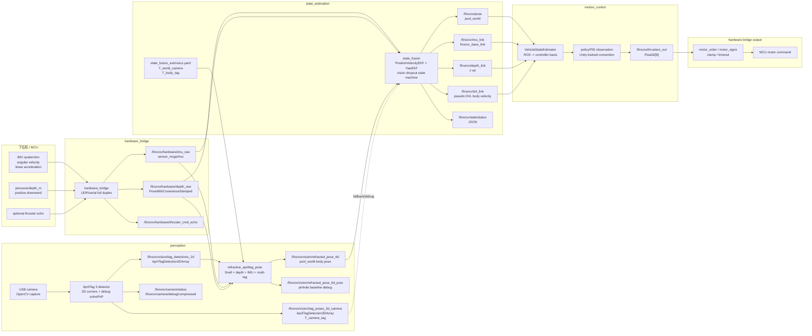
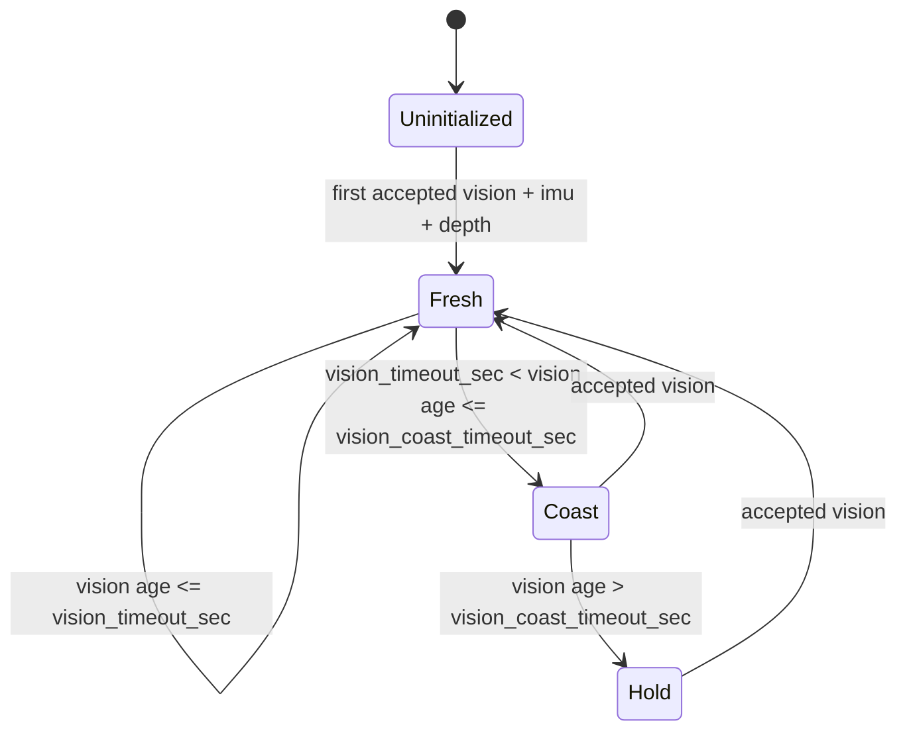

# FinsROV 实船状态融合链路说明

标定总入口见：

```text
docs/calibration/index.zh-CN.md
```

本文保留状态融合链路、EKF、控制接口和推进器映射的完整技术说明；相机内参、AprilTag、`T_world_camera`、`T_body_tag` 的现场标定顺序从顶层标定入口开始看。

Python fusion + 折射 AprilTag 6D measurement 的专门说明见：

```text
ros2_ws/src/state_estimation/docs/refractive_apriltag_fusion_algorithm.zh-CN.md
ros2_ws/src/state_estimation/docs/state_fusion_refractive_6d.zh-CN.md
```

本文档说明当前实船链路中，硬件回传、AprilTag 折射约束 6D 位姿、状态融合、`motion_controller` 和 Unity 训练模型坐标之间的关系。目标是让 `/finsrov/pose`、`/finsrov/imu_link`、`/finsrov/depth_link`、`/finsrov/dvl_link` 的来源、坐标系和安全状态都可以被明确检查。

核心原则：

```text
传感器/状态融合层：统一使用真实 ROS 物理坐标 pool_world，右手系，z-up，z=0 为水池中心底部
controller/model 层：只在 motion_controller 入口做一次 ROS -> Unity/model basis 转换；position 额外做水面零点 offset
硬件推进器层：只处理推进器顺序、符号、限幅和通信，不处理状态坐标系
```

## 1. 总体数据流



实船运行时必须保证 `/finsrov/pose`、`/finsrov/imu_link`、`/finsrov/dvl_link`、`/finsrov/depth_link` 只有实船状态链路发布。旧 Unity 仿真节点，例如 `/syntetic_data`，如果也发布这些 topic，会把仿真状态和实船状态混在一起，控制器会收到随机污染数据。

检查命令：

```bash
cd ros2_ws
./scripts/run_ros2_uv.sh ros2 topic info /finsrov/pose -v
./scripts/run_ros2_uv.sh ros2 topic info /finsrov/imu_link -v
./scripts/run_ros2_uv.sh ros2 topic info /finsrov/dvl_link -v
./scripts/run_ros2_uv.sh ros2 topic info /finsrov/depth_link -v
```

## 2. 模块职责

### 2.1 `hardware_bridge`

输入：

```text
/finsrov/thrusters_out
```

输出：

```text
/finsrov/hardware/imu_raw
/finsrov/hardware/depth_raw
/finsrov/hardware/status
/finsrov/hardware/thruster_cmd_echo
```

当前硬件 telemetry payload 包含：

```text
quat_wxyz[4] float32
angular_velocity_xyz[3] float32
linear_acceleration_xyz[3] float32
depth_m float32
pressure_pa float32
status_flags uint32
```

`hardware_bridge` 做的事情：

```text
quat_wxyz -> sensor_msgs/Imu.orientation xyzw
angular_velocity_xyz -> Imu.angular_velocity
linear_acceleration_xyz -> Imu.linear_acceleration
depth_m -> /finsrov/hardware/depth_raw.pose.pose.position.z
```

重要约定：

```text
depth_m 是水压计位置处的水深，向下为正
/finsrov/hardware/depth_raw 仍然保留正深度
state_fusion 负责转换为 pool_world z-up，并把水压计位置修正到 body 原点
```

`hardware_bridge` 不负责把 MCU/IMU 板载坐标旋转到 ROS body。也就是说，MCU 回传的 quaternion、角速度、线加速度应当已经表达在 `finsrov_base_link` 约定下；如果板载 IMU 安装方向不同，需要在 MCU 或 hardware bridge 增加 IMU 外参修正。

### 2.2 `perception`

输入：

```text
USB camera
camera calibration YAML
AprilTag family / tag size
```

输出：

```text
/finsrov/vision/tag_detections_2d
/finsrov/vision/refracted_pose_6d
/finsrov/vision/refracted_pose_6d_pure
/finsrov/vision/refracted/status
/finsrov/vision/tag_poses_3d_camera
/finsrov/vision/pose_3d_camera
/finsrov/camera/status
/finsrov/camera/debug/compressed
```

主链路语义：

```text
/finsrov/vision/tag_detections_2d:
  AprilTag 角点像素，不经过 image_raw ROS 序列化。

/finsrov/vision/refracted_pose_6d:
  pool_world 下的 ROV body pose。
  x/y/yaw 由角点折射几何求解，z 由水压计深度约束，roll/pitch 由 IMU 提供。

/finsrov/vision/refracted_pose_6d_pure:
  普通 pinhole multi-tag PnP debug/baseline，不考虑水面折射。
```

旧 PnP 输出仍保留用于 debug/fallback：

```text
T_camera_tag
```

即 AprilTag 在相机坐标系下的 3D 位姿。它由 AprilTag 角点、相机内参、畸变参数和 tag 边长通过 `cv::solvePnP` 得到。`pose.position.z` 是相机光轴方向距离，不是水压计深度。

`/finsrov/vision/tag_poses_3d_camera` 支持一帧内多个 tag，每个检测包含：

```text
tag_id
pose: T_camera_tag
decision_margin
reprojection_error_px
```

### 2.3 `state_estimation`

订阅：

```text
/finsrov/vision/refracted_pose_6d
/finsrov/hardware/imu_raw
/finsrov/hardware/depth_raw
```

默认配置：

```yaml
use_vision_6d: true
vision_6d_topic: /finsrov/vision/refracted_pose_6d
use_vision_pnp: false
```

`/finsrov/vision/tag_poses_3d_camera` 仍可作为 debug/fallback，但不是默认实船主输入。旧的平面 pose topic 链路已经删除。

发布：

```text
/finsrov/pose
/finsrov/imu_link
/finsrov/depth_link
/finsrov/dvl_link
/finsrov/state/status
```

状态融合层只使用 `pool_world` 和 `finsrov_base_link`。不在这里转换到 Unity/model 坐标。

### 2.4 `motion_control`

`motion_controller` 订阅状态融合输出，然后在 `VehicleStateEstimator` 里做唯一的 ROS -> controller/model basis 转换。这个转换是为了复用 Unity 训练出来的 controller/RL policy。

## 3. 坐标系约定

### 3.1 ROS 世界坐标 `pool_world`

```text
右手系
z 轴向上
z=0 为水池中心底部平面
position.z = body_z
```

当前实船水压计安装在潜器底部，距离 body 原点 0.115 m。body frame 是 z-up，因此：

```yaml
# 运行时唯一配置源:
# ros2_ws/src/state_estimation/config/pool_world.yaml
water_surface_z_m: 0.98
pressure_sensor_offset_z_body: -0.115
```

深度修正公式：

```text
pressure_sensor_z = water_surface_z_m + depth_raw.z * depth_sign
pressure_sensor_offset_world_z = pressure_sensor_offset_z_body * cos(roll) * cos(pitch)
body_z = pressure_sensor_z - pressure_sensor_offset_world_z
```

水平姿态下：

```text
body_z = water_surface_z_m - depth_m + 0.115
```

`pool_world` 原点应该和实船实验场景中定义的控制/任务原点一致。状态估计层始终发布真实物理坐标，不为了 Unity 训练环境移动原点。Unity 训练时 `controller.y=0` 表示水平面/水面，而当前 `pool_world.z=0` 表示水池底部，因此这部分平移只放在 `motion_controller` 入口处理。

例如潜器下潜 1 m：

```text
depth_m = +0.98
water_surface_z_m = 0.98
/finsrov/pose.pose.pose.position.z = 0.115
```

### 3.2 ROS 机体系 `finsrov_base_link`

`finsrov_base_link` 是实船状态估计和控制共同使用的机体原点。它必须和 Unity 训练时的 ROV root/control center 对应同一个物理点，否则只做轴转换无法修正原点偏移。

本文档中只要写 `body frame` 或 `finsrov_base_link`，默认都是 ROS 物理机体系，而不是 Unity/controller 坐标。轴定义采用 ROS 常用 FLU 约定：

```text
x: forward，潜器艇艏/前进方向
y: left，潜器左舷方向
z: up，潜器上方方向
```

这是右手系：`x cross y = z`。正 yaw 是绕 `+z` 轴从 `+x` 朝 `+y` 旋转，也就是从上往下看逆时针。

要求：

```text
AprilTag 到 body 原点的偏移/旋转推荐写入 T_body_tag
IMU 角速度/加速度应表达在这个 body frame 下
DVL/pseudo-DVL 速度表达在这个 body frame 下
```

### 3.3 相机坐标 `finsrov_overhead_camera`

PnP 输出使用相机坐标系。文档中只把它作为 `T_camera_tag` 的源，不直接把它作为控制坐标。固定相机到水池世界系的转换由：

```text
T_world_camera
```

提供。

### 3.4 Controller / Unity-trained model 坐标

Unity 训练模型使用 controller/model 坐标约定：

```text
controller.x = forward
controller.y = up
controller.z = left
```

所以 controller/model body 与 ROS `finsrov_base_link` 的区别是 y/z 交换：

```text
controller.x = ros_body.x = forward
controller.y = ros_body.z = up
controller.z = ros_body.y = left
```

默认 ROS -> controller basis：

```yaml
ros_to_controller_basis_indices: [0, 2, 1]
ros_to_controller_basis_signs: [1.0, 1.0, 1.0]
# ros_to_controller_position_offset is derived from water_surface_z_m:
# [0.0, -water_surface_z_m, 0.0]
```

矩阵形式：

```text
B =
[ 1  0  0 ]
[ 0  0  1 ]
[ 0  1  0 ]
```

向量转换：

```text
v_controller = B * v_ros
p_controller = B * p_ros + p_offset

controller.x = ros.x
controller.y = ros.z
controller.z = ros.y
```

其中 `p_offset` 只用于 position：

```text
p_offset = [0, -water_surface_z_m, 0]
```

当前实船配置 `water_surface_z_m=0.98`，定义在：

```text
ros2_ws/src/state_estimation/config/pool_world.yaml
```

这样 ROS 世界中水面 `pool_world.z=0.98` 会变成 Unity/controller 中 `controller.y=0`；池底 `pool_world.z=0` 会变成 `controller.y=-0.98`。速度、加速度、角速度和 body-frame 相对位移不加这个平移。

位置、线速度和线加速度等普通向量使用 `B`。角速度是轴向量；默认
`det(B)=-1`，因此必须使用 `A=det(B)*B`：

```text
v_controller = B * v_ros
omega_controller = A * omega_ros
[wx, wy, wz]_controller = [-wx, -wz, -wy]_ros
```

角速度协方差使用 `A*C*A.T`，混合线性/角速度的 6D 协方差使用
`diag(B,A)`。命令已经是 controller 坐标，不重复变换。

姿态转换：

```text
R_controller = B * R_ros * B^T
```

不要手动交换 quaternion 分量。代码路径是：

```text
motion_control.math_utils.transform_quat_basis()
```

## 4. 外参和位姿变换

### 4.1 矩阵语义

本文使用：

```text
T_A_B
```

表示把 B 坐标系下的点变换到 A 坐标系。

旧 pinhole PnP 6D 位姿链路：

```text
T_world_body = T_world_camera * T_camera_tag * inverse(T_body_tag)
```

含义：

```text
T_world_camera: 固定相机在 pool_world 下的外参
T_camera_tag: AprilTag PnP 输出，tag 在 camera 下的位姿
T_body_tag: AprilTag 在 ROV body 下的外参
```

`T_body_tag` 是推荐人工测量和配置的方向，表示：

```text
p_body = T_body_tag * p_tag
```

也就是 tag 中心/姿态在 `finsrov_base_link` 下的位置和方向。状态融合内部使用的是 `inverse(T_body_tag)`，等价于：

```text
T_tag_body = inverse(T_body_tag)
p_tag = T_tag_body * p_body
```

当前现场配置统一写 `T_body_tag`。旧字段 `T_tag_body` 不再作为标定入口使用，避免手动取逆和多 tag 外参方向混乱。

当前默认主链路不是直接使用 `T_camera_tag`，而是由 `refractive_apriltag_pose_node` 使用每个 tag 的 2D 角点、`T_body_tag`、`T_world_camera`、水深和 IMU 姿态联合求解 `T_world_body`：

```text
direct_apriltag_node:
  输出 tag corner pixels

refractive_apriltag_pose_node:
  corner pixels + T_world_camera + T_body_tag + depth + IMU
  -> /finsrov/vision/refracted_pose_6d

state_fusion:
  /finsrov/vision/refracted_pose_6d + depth + IMU
  -> EKF 输出 /finsrov/pose
```

旧 pinhole PnP fallback 仍可用，链路为：

```text
T_world_body = T_world_camera * T_camera_tag * inverse(T_body_tag)
```

如果 AprilTag 贴在潜器顶部，而不是贴在机体原点，那么必须用 tag-body 外参把“tag 位姿”转换成“潜器 body 位姿”。`T_body_tag` 的人工测量方法统一维护在 `docs/calibration/tag-body-extrinsic.zh-CN.md` 和 `ros2_ws/src/state_estimation/docs/t_body_tag_extrinsic.zh-CN.md`。

### 4.2 外参配置文件

文件：

```text
ros2_ws/src/state_estimation/config/state_fusion_extrinsics.yaml
```

`T_body_tag` 的完整填写说明见：

```text
ros2_ws/src/state_estimation/docs/t_body_tag_extrinsic.zh-CN.md
```

当前结构：

```yaml
T_world_camera:
  translation_xyz: [...]
  rotation_xyzw: [...]

# 现场测量方向，tag -> body
T_body_tag:
  4:
    translation_xyz: [...]
    rotation_rpy_deg: [...]
```

`T_body_tag` 的矩阵语义是：

```text
p_body = T_body_tag * p_tag
```

也就是说，`translation_xyz` 就是 tag 中心在 `finsrov_base_link` 下的位置：

```text
translation_xyz = [tag_center_x_body, tag_center_y_body, tag_center_z_body]
```

`rotation_rpy_deg` 是 tag frame 相对 body frame 的姿态，采用：

```text
R_body_tag = Rz(yaw) * Ry(pitch) * Rx(roll)
```

如果 tag 贴在潜器上表面，tag 正面朝上，并且 tag 的 `+x` 方向指向潜器前方，那么通常：

```yaml
rotation_rpy_deg: [0.0, 0.0, 0.0]
```

如果 tag 正面朝上，但 tag 的 `+x` 方向指向潜器左侧，那么：

```yaml
rotation_rpy_deg: [0.0, 0.0, 90.0]
```

如果 tag 正面朝上，但 tag 的 `+x` 方向指向潜器右侧，那么：

```yaml
rotation_rpy_deg: [0.0, 0.0, -90.0]
```

支持三种旋转写法：

```yaml
rotation_xyzw: [x, y, z, w]
rotation_rpy_deg: [roll_deg, pitch_deg, yaw_deg]
matrix: [16 个数，4x4 row-major]
```

如果使用多个 tag，每个 tag id 都必须有对应的 `T_body_tag`。没有外参的 tag 会在视觉层被忽略；旧 PnP fallback 中也会被拒绝，并在 `/finsrov/state/status` 里的 `reject_reason` 显示 `unknown_tag_<id>`。

### 4.3 如何人工测定 T_body_tag

本文件不再重复维护 `T_body_tag` 的人工测量教程。统一入口：

```text
docs/calibration/tag-body-extrinsic.zh-CN.md
ros2_ws/src/state_estimation/docs/t_body_tag_extrinsic.zh-CN.md
```

这里保留一个判断原则：如果潜器上多个 tag 分别反推出的 body pose 不一致，优先检查 `T_body_tag.translation_xyz`、`T_body_tag.rotation_rpy_deg`、tag id 和 `marker_length_m`，不要先调 EKF 参数。

### 4.4 多 tag 融合

默认折射 6D 主链路中，同一帧检测到多个已知 tag 时：

```text
1. 把每个 tag 的四个角点通过 T_body_tag 转为 body frame 下的 3D 点
2. 用水深和 IMU roll/pitch 约束每个角点的世界 z
3. 对每个像素角点按 Snell 定律反投影到对应 z 平面
4. 联合所有角点优化 [x, y, yaw]
5. 输出 position=[x, y, body_z] 和 quaternion=[roll_imu, pitch_imu, yaw_visual]
```

旧 PnP fallback 中，多 tag 逻辑是：

```text
1. 每个 tag 分别计算一个 T_world_body 候选
2. 如果候选位置之间冲突超过 multi_tag_conflict_distance_m，选择 reprojection_error 最低的 tag
3. 如果候选一致，则按协方差和 reprojection_error 加权融合位置和 yaw
```

## 5. EKF 融合模型

### 5.1 PositionVelocityEKF

状态：

```text
x = [px, py, pz, vx, vy, vz]^T
```

预测模型是常速度模型：

```text
px[k+1] = px[k] + vx[k] * dt
py[k+1] = py[k] + vy[k] * dt
pz[k+1] = pz[k] + vz[k] * dt
vx[k+1] = vx[k]
vy[k+1] = vy[k]
vz[k+1] = vz[k]
```

过程噪声来自：

```yaml
ekf_process_noise_position: 0.02
ekf_process_noise_velocity: 0.10
```

视觉更新：

```text
默认使用 /finsrov/vision/refracted_pose_6d 更新 px, py
use_vision_6d_z=false，因此视觉 6D 的 z 默认不更新 pz
use_vision_pnp=false，因此旧 /finsrov/vision/tag_poses_3d_camera 默认不参与 EKF
```

深度更新：

```text
p_sensor_z = water_surface_z_m + depth_raw.z * depth_sign
depth_sign = -1.0
offset_world_z = pressure_sensor_offset_z_body * cos(roll) * cos(pitch)
pz = p_sensor_z - offset_world_z
```

测量门限：

```yaml
measurement_gate_mahalanobis: 9.0
max_reprojection_error_px: 4.0
```

如果观测被拒绝，`reject_reason` 会写入 `/finsrov/state/status`。

### 5.2 YawEKF

Yaw EKF 是一维滤波：

```text
yaw[k+1] = yaw[k] + gyro_z * dt
```

更新源：

```text
IMU quaternion -> roll, pitch, yaw
AprilTag refracted_pose_6d -> vision yaw
```

当前输出姿态：

```text
roll, pitch 直接来自 IMU quaternion
yaw 来自 YawEKF
quat = rpy_to_quat(roll_imu, pitch_imu, yaw_fused)
```

如果：

```yaml
use_vision_yaw: true
```

AprilTag yaw 会低频校正 IMU yaw。

### 5.3 伪 DVL 速度

当前没有真实 DVL 时，`/finsrov/dvl_link` 是 EKF 位置状态中的速度估计转换到 body frame：

```text
v_body = R_world_body^T * v_world
```

输出 topic：

```text
/finsrov/dvl_link
```

它是“pseudo DVL”，不是硬件 DVL 原始数据。

## 6. 视觉丢帧状态机

AprilTag 可能被遮挡，或潜器运行到摄像头视野外。状态融合不允许因此让 EKF 无限漂移。

状态机：



对应 `vision_mode`：

| `vision_mode`   | 含义               | `/finsrov/pose` / `/finsrov/dvl_link` |
| ----------------- | ------------------ | ----------------------------------------- |
| `uninitialized` | 从未接受过视觉位姿 | 默认不发布，避免假状态进入控制器          |
| `fresh`         | 视觉正常           | 正常发布                                  |
| `coast`         | 短时视觉丢失       | 短时间预测发布                            |
| `hold`          | 视觉丢失过久       | 冻结最后视觉 x/y，x/y 速度衰减到 0        |

关键参数：

```yaml
vision_timeout_sec: 0.25
vision_coast_timeout_sec: 0.75
vision_hold_velocity_decay: 0.50
max_position_covariance_xy: 4.0
max_velocity_covariance_xy: 1.0
publish_pose_before_ready: false
```

`publish_pose_before_ready=false` 是安全设置。含义是：

```text
在首次 vision + depth + imu 都有效前，不发布 /finsrov/pose 和 /finsrov/dvl_link
```

这样控制器不会吃到 `[0,0,depth]` 这种未初始化假位置。

## 7. 发布 topic 语义

### 7.1 `/finsrov/pose`

类型：

```text
geometry_msgs/PoseWithCovarianceStamped
```

frame：

```text
pool_world
```

语义：

```text
position.x/y 来自 AprilTag 折射约束 6D pose + EKF
position.z 来自 water_surface_z_m、depth_m、depth_sign 和 pressure_sensor_offset_z_body，修正到 body 原点
orientation roll/pitch 来自 IMU
orientation yaw 来自 YawEKF
```

### 7.2 `/finsrov/imu_link`

类型：

```text
sensor_msgs/Imu
```

frame：

```text
finsrov_base_link
```

语义：

```text
orientation 是融合后的 roll/pitch/yaw quaternion
angular_velocity 当前直接复制 imu_raw，仍保持 ROS/body 物理坐标；它不是
controller 坐标。进入 controller 前由 `controller_state_adapter` 按轴向量
规则转换。
linear_acceleration 当前直接复制 imu_raw
```

hardware bridge 当前已将 H30 sensor frame `x后、y右、z上` 通过绕 z 轴 180 度的
安装外参统一修正到 `finsrov_base_link` 的 ROS FLU `x前、y左、z上`。state fusion
只消费校正结果，不再执行第二次安装旋转；否则角速度、加速度和姿态会被重复翻转。

### 7.3 `/finsrov/depth_link`

类型：

```text
geometry_msgs/PoseWithCovarianceStamped
```

语义：

```text
pose.position.z = body_z = water_surface_z_m + depth_raw.z * depth_sign - pressure_sensor_offset_world_z
```

### 7.4 `/finsrov/dvl_link`

类型：

```text
geometry_msgs/TwistWithCovarianceStamped
```

frame：

```text
finsrov_base_link
```

语义：

```text
linear velocity = EKF velocity transformed to body frame
angular velocity currently not filled
```

## 8. Controller 入口坐标转换

`motion_controller` 通过 `VehicleStateEstimator` 读取：

```text
/finsrov/pose
/finsrov/imu_link
/finsrov/depth_link
/finsrov/dvl_link
```

然后用同一套 basis 转换到 Unity-trained controller/model 坐标。位置额外加一次 offset，因为 Unity 训练环境里 `controller.y=0` 是水面，而实船 `pool_world.z=0` 是水池底部：

```text
p_controller = B * p_ros + p_offset
v_controller = B * v_ros
a_controller = B * a_ros
A = det(B) * B
omega_controller = A * omega_ros
R_controller = B * R_ros * B^T
```

当前 basis：

```text
B =
[ 1  0  0 ]
[ 0  0  1 ]
[ 0  1  0 ]
```

因此：

```text
ROS pool_world z-up: [x, y, z]
controller/model:    [x, z - water_surface_z_m, y]
```

当前 launch 会从 `pool_world.yaml` 注入：

```text
ros_to_controller_position_offset = [0.0, -water_surface_z_m, 0.0]
```

只对绝对位置生效：

```text
/finsrov/pose.position
position-mode target_position_world
pose20 observation 中的 target/current position
```

不对这些量生效：

```text
linear velocity
angular velocity
linear acceleration
body-frame relative command offset
orientation quaternion
```

这里“angular velocity 不加 offset”不等于“直接使用 `B`”。实际转换由
`controller_state_adapter` 完成：角速度使用 `A=det(B)*B`，姿态使用旋转矩阵
换基。状态估计发布的 `/finsrov/imu_link` 仍保持 ROS/body 物理坐标；只有
adapter 发布的 `/finsrov/controller/imu` 才是 controller 坐标。

`header.frame_id` 现在严格指定 controller 坐标系，不再做命令侧隐式转换：

```text
controller_world:
  controller/Unity 世界坐标

controller_body:
  controller/Unity 自体坐标

其它 frame:
  拒绝
```

`send_position_goal` 现在只接受显式 controller frame，不再兼容旧的 `world/body` 参数：

```text
send_position_goal --frame controller_world:
  topic = /motion_controller/command/position_controller_world
  msg.header.frame_id = controller_world
  x/y/z = Unity/controller 世界坐标下的绝对目标点

send_position_goal --frame controller_body:
  topic = /motion_controller/command/position_controller_body 或 /motion_controller/command/pose_controller_body
  msg.header.frame_id = controller_body
  x/y/z = Unity/controller 机体系下的相对位移
```

所以这条命令：

```bash
ros2 run motion_control send_position_goal --frame controller_world --x 0.0 --y -0.5 --z 0.0 --yaw 90
```

语义是：

```text
target_controller = [0.0, -0.5, 0.0]
target_yaw_controller = 90 deg
```

其中 `controller.y=-0.5` 表示水面原点下方 0.5 m。它不是 `pool_world.y=-0.5`，也不会再套用 `ros_to_controller_position_offset`。如果手动发布真正的 ROS/pool_world 绝对目标，必须自己构造 `PoseStamped` 并设置 `header.frame_id=pool_world`。

## 9. 控制输出到推进器

`motion_controller` 发布：

```text
/finsrov/thrusters_out
```

这是一个 `std_msgs/Float32MultiArray`，长度固定为 8。数值语义由 `motion_controller` 的 `thruster_output_mode` 决定：

```text
normalized_direct / normalized_rpm:
  -1.0 = 最大反向
   0.0 = 停止
  +1.0 = 最大正向

force_n:
  单位是 N，每个数表示该 canonical 推进器的期望推力
```

V4 Pro1 实船控制默认使用 `force_n`。这时 `motion_controller` 先用 `thruster_force_limits_n` 把算法输出映射到 N，`hardware_bridge` 再用实测 `thruster_curve` 把 N 反解成 RPM。

在实船链路里，`/finsrov/thrusters_out` 不直接等于 MCU 的物理电机顺序。它先进入 `hardware_bridge`，由 bridge 做：

```text
1. 输入长度检查
2. 根据 command_mode 处理数值范围
3. 按 motor_order 重排
4. 按 motor_signs 修正单路正负方向
5. 按 output_scale 做全局比例
6. 打包成 MCU direct thruster command frame
7. 通过 UDP -> NX -> UART 发给 MCU
8. MCU 按实船安全输出范围应用到电机
```

这部分只处理电机映射、限幅、安全超时和通信，不处理状态估计坐标。状态估计里的 `pool_world`、`finsrov_base_link`、ROS -> controller/model basis 转换都已经在前面的链路完成。

### 9.1 输入顺序：Unity canonical order

当前 `hardware_bridge` 认为 `/finsrov/thrusters_out` 的输入顺序是 Unity canonical order：

```text
index 0: V_LF  left-front  vertical
index 1: V_LB  left-back   vertical
index 2: V_RB  right-back  vertical
index 3: V_RF  right-front vertical
index 4: H_LF  left-front  horizontal
index 5: H_LB  left-back   horizontal
index 6: H_RB  right-back  horizontal
index 7: H_RF  right-front horizontal
```

简写数组：

```text
[V_LF, V_LB, V_RB, V_RF, H_LF, H_LB, H_RB, H_RF]
```

这里的 `V/H` 表示控制器和仿真模型里的推进器类型，不是 MCU 接线顺序。

### 9.2 MCU 输出顺序：direct command order

MCU direct command frame 中 8 个 float 的顺序是物理电机顺序：

```text
MCU output 0: M1 motorLFLower
MCU output 1: M2 motorLFUpper
MCU output 2: M3 motorLBUpper
MCU output 3: M4 motorLBLower
MCU output 4: M5 motorRBLower
MCU output 5: M6 motorRBUpper
MCU output 6: M7 motorRFUpper
MCU output 7: M8 motorRFLower
```

简写数组：

```text
[M1 LF lower, M2 LF upper, M3 LB upper, M4 LB lower,
 M5 RB lower, M6 RB upper, M7 RF upper, M8 RF lower]
```

这和 `/finsrov/thrusters_out` 的输入顺序不是同一个东西，所以必须由 bridge 做重排。

### 9.3 映射公式

桥接层参数是：

```yaml
motor_order: [4, 5, 0, 1, 2, 7, 6, 3]
motor_signs: [-1.0, -1.0, -1.0, 1.0, -1.0, 1.0, -1.0, -1.0]
```

公式固定为：

```text
mcu_output[i] =
  clamp(thrusters_out[motor_order[i]], -1, 1)
  * motor_signs[i]
  * output_scale
```

注意两个数组的索引都是 MCU output index，不是 Unity canonical input index。

也就是说：

```text
motor_order[i] 表示 MCU 第 i 路从 /finsrov/thrusters_out 的哪个 index 取值
motor_signs[i] 表示 MCU 第 i 路取值后是否反向
```

当前配置展开后是：

| MCU output | MCU physical motor | input index | input name | sign | bridge output         |
| ---------: | ------------------ | ----------: | ---------- | ---: | --------------------- |
|          0 | M1 motorLFLower    |           4 | H_LF       | -1.0 | `-thrusters_out[4]` |
|          1 | M2 motorLFUpper    |           5 | H_LB       | -1.0 | `-thrusters_out[5]` |
|          2 | M3 motorLBUpper    |           0 | V_LF       | -1.0 | `-thrusters_out[0]` |
|          3 | M4 motorLBLower    |           1 | V_LB       | +1.0 | `+thrusters_out[1]` |
|          4 | M5 motorRBLower    |           2 | V_RB       | -1.0 | `-thrusters_out[2]` |
|          5 | M6 motorRBUpper    |           7 | H_RF       | +1.0 | `+thrusters_out[7]` |
|          6 | M7 motorRFUpper    |           6 | H_RB       | -1.0 | `-thrusters_out[6]` |
|          7 | M8 motorRFLower    |           3 | V_RF       | -1.0 | `-thrusters_out[3]` |

### 9.4 为什么在 hardware_bridge 层修正

推进器映射放在 `hardware_bridge` 层，而不是放在 MCU、Unity 或控制器算法里，原因是：

```text
motion_controller / RL / PID:
  继续使用仿真训练时的 canonical order，避免算法侧和硬件侧耦合。

Unity:
  继续作为模型训练和仿真环境，不因为某一台实船接线变化而修改。

MCU:
  尽量保持 direct command frame 是物理电机顺序，方便底层电机保护和回显。

hardware_bridge:
  正好处在“仿真控制输出”和“真实硬件接线”之间，适合做顺序和符号适配。
```

因此不同实船、不同接线、不同电机安装方向，只应该优先改 `hardware_bridge` 的 `motor_order` 和 `motor_signs`。

### 9.5 安全限幅和 enabled

bridge 发给 MCU 的 frame 里包含：

```text
enabled: bool
thrust[8]: float32
```

当前实船安全策略是：

```text
hardware_bridge:
  normalized_* 模式下 clamp 到 [-1, 1]
  force_n 模式下按 thruster_curve 把 force_N 反解成 target RPM
  enabled=false 时仍可发送 frame，但 MCU 不应应用到电机
  长时间没有收到 /finsrov/thrusters_out 时发送 0 推力

MCU:
  把 direct command 的 [-1, 1] 应用到固件安全输出范围
```

因此在 `force_n` 模式下，控制器输出 `0.2` 表示 `0.2 N`，不是 `20%` 油门。`motion_controller` 的 `thruster_force_limits_n` 应该使用 command-limited 曲线的最大可用力，不要再乘一次 `0.4`：

```yaml
thruster_force_limits_n:
  positive: [8.4749, 7.3809, 7.3809, 8.4749, 7.3809, 8.4749, 7.3809, 8.4749]
  negative: [7.9750, 5.7618, 5.7618, 7.9750, 5.7618, 7.9750, 5.7618, 7.9750]
```

这些值来自 `ros2_ws/data/thruster_curve/finsrov_v4_pro1` 和 `finsrov_hardware_bridge_v4_pro1.yaml` 中的 `c1_positive/c1_negative/rpm_min/rpm_max`。曲线已经表达了上位机 command `[-1, 1]` 经下位机安全范围后的实际可用 RPM 边界。

检查 bridge 是否 arm：

```bash
cd ros2_ws
./scripts/run_ros2_uv.sh ros2 param get /hardware_bridge enabled
```

启动时也可以直接覆盖 `enabled/debug_mask/debug_echo_decimation`：

```bash
./scripts/run_ros2_uv.sh ros2 launch hardware_bridge hardware_bridge.launch.py \
  params_file:=./ros2_ws/src/hardware_bridge/config/finsrov_hardware_bridge_nature_test.yaml \
  debug_mask:=1 \
  debug_echo_decimation:=1 \
  enabled:=true
```

这些 launch arguments 会覆盖 YAML 里的同名参数；不传时使用 YAML。

运行中打开硬件输出前必须确认潜器和电机环境安全：

```bash
./scripts/run_ros2_uv.sh ros2 param set /hardware_bridge enabled true
```

关闭：

```bash
./scripts/run_ros2_uv.sh ros2 param set /hardware_bridge enabled false
```

### 9.6 动态调整参数

查看当前映射：

```bash
cd ros2_ws
./scripts/run_ros2_uv.sh ros2 param get /hardware_bridge motor_order
./scripts/run_ros2_uv.sh ros2 param get /hardware_bridge motor_signs
```

设置当前实测配置：

```bash
./scripts/run_ros2_uv.sh ros2 param set /hardware_bridge motor_order "[4, 5, 0, 1, 2, 7, 6, 3]"
./scripts/run_ros2_uv.sh ros2 param set /hardware_bridge motor_signs "[-1.0, -1.0, -1.0, 1.0, -1.0, 1.0, -1.0, -1.0]"
```

`motor_order` 是整数数组，`motor_signs` 是浮点数组。`motor_signs` 必须写成 `1.0` 或 `-1.0`，不要写成 `1` 或 `-1`，否则 ROS2 parameter 可能把它解析成 integer array，导致：

```text
Setting parameter failed: value must be a float array
```

如果要永久保存，修改实际启动使用的 bridge YAML，例如：

```text
ros2_ws/src/hardware_bridge/config/finsrov_hardware_bridge_v4_pro1.yaml
ros2_ws/src/hardware_bridge/config/finsrov_hardware_bridge_v4_pro2.yaml
ros2_ws/src/hardware_bridge/config/finsrov_hardware_bridge_nature_test.yaml
```

具体用哪个 YAML 取决于你的 launch 文件和当前实船配置。修改后如果不是 `--symlink-install`，需要重新 build 或确认 install 目录里的配置已更新。

### 9.7 用 echo 验证映射

打开 MCU 推力回显：

```bash
cd ros2_ws
./scripts/run_ros2_uv.sh ros2 param set /hardware_bridge debug_mask 1
./scripts/run_ros2_uv.sh ros2 param set /hardware_bridge debug_echo_decimation 1
```

监听回显：

```bash
./scripts/run_ros2_uv.sh ros2 topic echo /finsrov/hardware/thruster_cmd_echo --full-length
```

点动输入 index 0，也就是 `V_LF`：

```bash
./scripts/run_ros2_uv.sh ros2 topic pub -r 5 /finsrov/thrusters_out std_msgs/msg/Float32MultiArray \
  "{data: [0.2, 0.0, 0.0, 0.0, 0.0, 0.0, 0.0, 0.0]}"
```

按当前 V4 Pro1 映射，`V_LF` 会进入：

```text
input index 0 -> MCU output 2 -> M3 motorLBUpper -> sign -1.0
```

所以 echo 中应看到 MCU 第 2 路收到非零值，其余路接近 0。注意 echo 中的 `received_thrust/applied_thrust` 是 MCU direct command 或 debug 语义，不等价于 `/finsrov/thrusters_out` 的 force_N 物理单位；如果 bridge 处于 `force_n`，应同时看 `/finsrov/hardware/status` 中的 command_mode 和 RPM 回传来确认 force->RPM 是否生效。

如果 `received_thrust` 有值但 `applied_thrust` 全是 0，优先看：

```text
enabled 是否为 true
accepted 是否为 true
reject_flags 是什么
```

如果动的是错误物理电机，改 `motor_order`。如果物理电机对了但推力方向反了，改该 MCU output 对应的 `motor_signs[i]`。

### 9.8 逐路点动建议

建议按照 Unity canonical input index 逐路点动，记录实际转动的物理电机和方向：

| input index | input name | 期望物理电机    |
| ----------: | ---------- | --------------- |
|           0 | V_LF       | M3 motorLBUpper |
|           1 | V_LB       | M4 motorLBLower |
|           2 | V_RB       | M5 motorRBLower |
|           3 | V_RF       | M8 motorRFLower |
|           4 | H_LF       | M1 motorLFLower |
|           5 | H_LB       | M2 motorLFUpper |
|           6 | H_RB       | M7 motorRFUpper |
|           7 | H_RF       | M6 motorRBUpper |

单路点动模板：

```bash
./scripts/run_ros2_uv.sh ros2 topic pub -r 5 /finsrov/thrusters_out std_msgs/msg/Float32MultiArray \
  "{data: [0.0, 0.0, 0.0, 0.0, 0.0, 0.0, 0.0, 0.0]}"
```

把需要点动的那一项改成 `0.15` 或 `-0.15`。如果硬件已经 arm，点动幅度从小值开始，不要直接发 `1.0`。

### 9.9 常见现象判断

| 现象                                                      | 优先检查                                                                                  |
| --------------------------------------------------------- | ----------------------------------------------------------------------------------------- |
| `/finsrov/thrusters_out` 有数据但电机不转               | `/hardware_bridge enabled`、MCU `accepted`、`reject_flags`                          |
| echo 里`enabled=false`                                  | bridge 没有 arm，执行`ros2 param set /hardware_bridge enabled true`                     |
| echo 里`received_thrust` 非零但 `applied_thrust` 为 0 | MCU 拒绝应用，查看`accepted/reject_flags`                                               |
| 点动一路，另一台电机转                                    | `motor_order` 错                                                                        |
| 点动一路，电机对但方向反                                  | 对应 MCU output 的`motor_signs` 错                                                      |
| 改`motor_signs` 后方向没变                              | 可能改到了错误 bridge 节点、存在重复`/hardware_bridge`、或者没有改对应 MCU output index |
| `ros2 param set motor_signs` 报 float array             | 数组里必须写`1.0/-1.0`                                                                  |
| bridge 一启动就发 0 帧                                    | 正常，`send_zero_on_start=true` 用于上电安全                                            |
| bridge 反复报 timeout 并发 0 帧                           | `/finsrov/thrusters_out` 没有持续发布，安全超时生效                                     |

检查是否有重复 bridge：

```bash
./scripts/run_ros2_uv.sh ros2 node list | sort | uniq -c
pgrep -af "hardware_bridge|ros2 launch hardware_bridge"
```

如果出现两个同名 `/hardware_bridge`，`ros2 param get/set /hardware_bridge ...` 的结果可能指向其中一个实例，但实际发 UDP 的是另一个实例。这会导致你以为打开了 debug 或改了 signs，实际硬件链路没有变。

### 9.10 聚合动作测试发送器

如果要验证“前进/后退/左转/右转/上浮/下潜”这些整体动作，不需要手写完整的 `ros2 topic pub`。`hardware_bridge` 提供了：

```bash
./scripts/run_ros2_uv.sh ros2 run hardware_bridge send_thruster_test MODE
```

它参照 Unity 的：

```text
unity/RLControl/Assets/Scripts/ControlForPosition.cs
```

中 `Heuristic()` 的 8 路动作生成逻辑，直接发布 Unity canonical order 的 `/finsrov/thrusters_out`。

模式表：

| mode           | Unity canonical 输出             |
| -------------- | -------------------------------- |
| `forward`    | `[0, 0, 0, 0, +a, +a, -a, -a]` |
| `backward`   | `[0, 0, 0, 0, -a, -a, +a, +a]` |
| `turn_left`  | `[0, 0, 0, 0, +t, +t, +t, +t]` |
| `turn_right` | `[0, 0, 0, 0, -t, -t, -t, -t]` |
| `up`         | `[+a, +a, +a, +a, 0, 0, 0, 0]` |
| `down`       | `[-a, -a, -a, -a, 0, 0, 0, 0]` |
| `stop`       | `[0, 0, 0, 0, 0, 0, 0, 0]`     |
| `index`      | 只点动一个 canonical index       |

其中：

```text
a = --amplitude，默认 0.2
t = clamp(--amplitude, -turn_limit, +turn_limit)，默认 turn_limit=0.1
默认发布频率 20Hz
默认持续 3 秒，结束时自动发一帧 0 推力
```

先只打印不发送：

```bash
./scripts/run_ros2_uv.sh ros2 run hardware_bridge send_thruster_test forward --amplitude 0.2 --print-only
```

disarm 下看 MCU echo：

```bash
./scripts/run_ros2_uv.sh ros2 param set /hardware_bridge enabled false
./scripts/run_ros2_uv.sh ros2 param set /hardware_bridge debug_mask 1
./scripts/run_ros2_uv.sh ros2 topic echo /finsrov/hardware/thruster_cmd_echo --full-length

./scripts/run_ros2_uv.sh ros2 run hardware_bridge send_thruster_test forward --amplitude 0.2 --rate 20 --duration 3
```

确认 echo 正确后，再 arm 小幅实测：

```bash
./scripts/run_ros2_uv.sh ros2 param set /hardware_bridge enabled true
./scripts/run_ros2_uv.sh ros2 run hardware_bridge send_thruster_test forward --amplitude 0.15 --duration 2
```

单路点动：

```bash
./scripts/run_ros2_uv.sh ros2 run hardware_bridge send_thruster_test index --index 7 --amplitude 0.15
```

`forward/backward/turn_left/turn_right` 的名字沿用 Unity heuristic 的正负输入语义；如果实船表现相反，要结合 echo 判断是 `motor_order`、`motor_signs`，还是整体正方向定义的问题。

## 10. 调试和验收检查

### 10.0 终端状态切换日志

`state_fusion` 会在状态机切换时输出一条 `[LOG]`，不会每帧刷屏。触发条件包括：

```text
ready / initialized 变化
vision_mode 变化
vision_fresh / imu_fresh / depth_fresh 变化
是否发布 navigation topic 变化
```

`used_tag_ids` 和 `reject_reason` 会作为切换瞬间的上下文写进日志，但它们本身不会触发日志。也就是说，`vision_mode=fresh` 保持不变时，即使某一帧视觉观测被 Mahalanobis gate 拒绝，也不会打印 `fresh -> fresh`。

日志示例：

```text
[LOG] fusion state change: transition=fresh -> coast, ready=True, initialized=True,
vision_mode=coast, fresh=(vision=False, imu=True, depth=True),
ages=(vision=0.312s, imu=0.006s, depth=0.007s),
publish_navigation=True, used_tag_ids=[4], reject_reason=no_pnp_detections,
cov_pos_diag=[0.003, 0.003, 0.001], cov_vel_diag=[0.2, 0.2, 0.05]
```

如果终端看到：

```text
vision_mode=uninitialized
publish_navigation=False
```

说明还没有拿到第一帧可靠 AprilTag 位姿，默认不会发布 `/finsrov/pose` 和 `/finsrov/dvl_link` 给控制器。

### 10.1 检查唯一 publisher

```bash
./scripts/run_ros2_uv.sh ros2 topic info /finsrov/pose -v
./scripts/run_ros2_uv.sh ros2 topic info /finsrov/imu_link -v
./scripts/run_ros2_uv.sh ros2 topic info /finsrov/dvl_link -v
./scripts/run_ros2_uv.sh ros2 topic info /finsrov/depth_link -v
```

实船状态 topic 不应同时被 `/syntetic_data` 或旧 Unity 仿真节点发布。

### 10.2 检查视觉是否初始化

```bash
./scripts/run_ros2_uv.sh ros2 topic echo /finsrov/state/status
```

重点看：

```text
ready
initialized
vision_mode
vision_fresh
used_tag_ids
reject_reason
vision_mahalanobis
position_covariance_diag
velocity_covariance_diag
```

控制器开始位置控制前，至少应看到：

```text
initialized=true
vision_mode=fresh 或 coast 或 hold
imu_fresh=true
depth_fresh=true
```

如果 `vision_mode=uninitialized`，说明还没有可靠的视觉初值，默认不会发布 `/finsrov/pose` 和 `/finsrov/dvl_link`。

### 10.3 检查深度符号

下潜 1 m 时：

```bash
./scripts/run_ros2_uv.sh ros2 topic echo /finsrov/hardware/depth_raw --once
./scripts/run_ros2_uv.sh ros2 topic echo /finsrov/depth_link --once
./scripts/run_ros2_uv.sh ros2 topic echo /finsrov/pose --once
```

应满足：

```text
hardware depth_raw.z ~= +1.0
water_surface_z_m ~= 1.0
depth_link.z ~= 0.0678
pose.position.z ~= 0.0678
```

### 10.4 检查 AprilTag 视觉链路

```bash
./scripts/run_ros2_uv.sh ros2 topic echo /finsrov/vision/tag_detections_2d --once --full-length
./scripts/run_ros2_uv.sh ros2 topic echo /finsrov/vision/refracted_pose_6d --once
./scripts/run_ros2_uv.sh ros2 topic echo /finsrov/vision/refracted/status --once --full-length
./scripts/run_ros2_uv.sh ros2 topic echo /finsrov/vision/tag_poses_3d_camera --once --full-length
./scripts/run_ros2_uv.sh ros2 topic echo /finsrov/camera/status --once --full-length
```

优先看 `/finsrov/vision/refracted/status`：

```text
constrained_valid=true:
  折射约束 6D pose 可用于 state_fusion

mode=missing_depth:
  没有深度，先检查 /finsrov/hardware/depth_raw

constrained_reject_reason=stale_depth_or_imu:
  深度或 IMU 和视觉时间差太大，先检查硬件桥是否在跑

constrained_reject_reason=geometry_error:
  T_world_camera、T_body_tag、marker_length_m、水面模型或 tag 角点质量有问题
```

如果 `/finsrov/vision/tag_detections_2d` 里 `detections: []`，视觉层没有检测到 tag。先解决相机、tag family、tag id、曝光、焦距、tag size、相机内参和检测阈值问题。

### 10.5 坐标系 sanity check

建议逐项检查：

```text
1. 潜器向 pool_world +x 移动，/finsrov/pose.x 增大
2. 潜器向 pool_world +y 移动，/finsrov/pose.y 增大
3. 潜器下潜，/finsrov/pose.z 变小
4. 潜器 yaw 正转，/finsrov/imu_link orientation 解算出的 yaw 符号符合预期
5. motion_controller 的 error_body 符号和 Unity 训练时一致
```

如果 1-4 正确但 controller 动作相反，优先检查：

```text
ros_to_controller_basis_indices/signs
motor_order/motor_signs
```

不要在 perception、EKF、hardware bridge 多处同时补符号。
