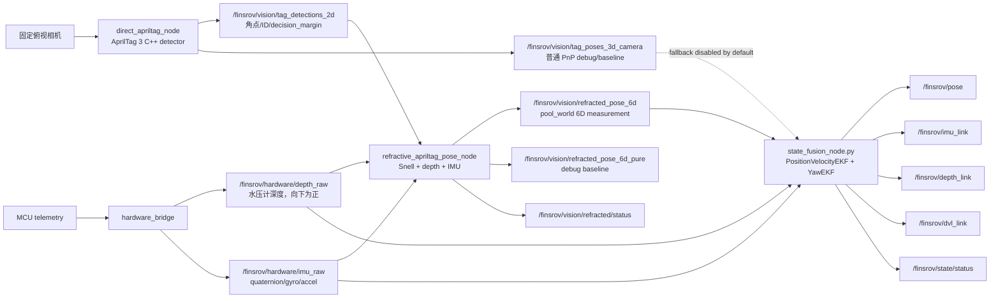

# Python State Fusion 与折射 AprilTag 6D 位姿链路

本文说明当前 FinsROV 实船链路中：

- AprilTag 的 `position + rotation` 是如何由相机角点、Snell 折射、水压计和 IMU 得到的。
- 多个 AprilTag 是如何一起使用的。
- IMU 漂移如何被视觉修正，哪些自由度目前没有修正。
- Python `state_fusion_node.py` 如何用 EKF 输出 `/finsrov/pose`、`/finsrov/imu_link`、`/finsrov/depth_link`、`/finsrov/dvl_link`。

先说结论：

```text
x/y/yaw: AprilTag 多角点 + Snell 折射 + 优化得到，yaw 低频修正 IMU gyro 积分漂移
z:       水压计 depth 强约束
roll/pitch: IMU quaternion 强约束，当前不由 AprilTag 修正
velocity:   PositionVelocityEKF 根据 position/depth 的异步观测估计
```

## 1. 三个核心问题

### 1.1 Snell 是优化问题还是直接公式解

当前主链路里的 Snell 定位是 **优化问题**，不是一次正向公式直接解出 6D pose。

但它也不是完整 6D 优化。当前 constrained 解只优化：

```text
state = [x, y, yaw]
```

其它自由度由传感器强约束：

```text
z     = pressure depth 转换出的 body_z
roll  = IMU roll
pitch = IMU pitch
```

所以它是：

```text
AprilTag 角点 + Snell 折射 + depth + IMU 的 3-DoF 几何优化
```

而不是：

```text
纯视觉直接硬解 [x, y, z, roll, pitch, yaw]
```

优化的基本残差是：

```text
r_jk = Q_world_jk(u_jk, P_world_jk.z) - P_world_jk(x, y, yaw)
```

其中：

- `u_jk` 是第 `j` 个 tag 的第 `k` 个角点像素。
- `P_world_jk` 是当前候选 pose 下，该刚体角点的预测世界坐标。
- `Q_world_jk` 是把像素 `u_jk` 按 Snell 折射反投影到 `P_world_jk.z` 深度平面后得到的世界点。

优化目标：

```text
min_{x,y,yaw} Σ_jk || Q_world_jk - P_world_jk ||²
```

当前代码没有引入 Ceres Solver，而是在 C++ 里实现了一个小规模 Levenberg-Marquardt 风格迭代。

### 1.2 多 tag 是怎么融合的

当前 constrained Snell 主链路中，多 tag 不是“每个 tag 算一个 pose，然后平均”。

它是 **角点级联合优化**：

```text
tag 15 的 4 个角点
tag 16 的 4 个角点
tag 17 的 4 个角点
...
全部转成同一个 body 刚体坐标下的 3D 点
一起放入同一个 residual vector
统一优化一个 [x, y, yaw]
```

对每个 tag：

```text
P_body_jk = T_body_tag_j * q_tag_corner_k
```

所有可见 tag 的角点组成：

```text
Samples = { (tag_id, P_body_jk, u_jk) }
```

然后统一求解：

```text
argmin_{x,y,yaw} Σ_{(j,k) in Samples} ||r_jk||²
```

这比“每个 tag 各算一个 pose 再融合”更适合刚性多 tag 板，因为多个 tag 之间的安装外参 `T_body_tag` 会自然形成刚体约束。

旧 PnP fallback 里才存在另一种逻辑：

```text
每个 tag 先得到一个 T_world_body 候选
如果候选冲突过大，选择 reprojection_error 最低的 tag
如果候选一致，按协方差/reprojection_error 加权融合
```

但当前默认主链路是 constrained Snell 角点级联合优化，不是这个 fallback。

### 1.3 IMU 漂移有没有用 AprilTag 修正

要分开看：

```text
roll/pitch: 当前主要相信 IMU，不用 AprilTag 修正
yaw:        IMU gyro 高频预测，AprilTag yaw 低频校正
```

原因：

- 俯视相机 + 顶部共面 AprilTag 对 `z/roll/pitch` 容易病态。
- 水面折射会进一步降低纯视觉 `z/roll/pitch` 的可靠性。
- 水压计对 z 更直接。
- IMU 短时间 roll/pitch 通常比视觉更稳定。
- IMU gyro 的 yaw rate 短时可信，但 yaw 积分会漂移。
- AprilTag yaw 在 `pool_world` 下有绝对几何意义，可用于修正 yaw 漂移。

Python `YawEKF` 的逻辑：

```text
predict:
  yaw_k^- = wrap(yaw_{k-1} + gyro_z * dt)

update:
  yaw_k = yaw_k^- + K * wrap(yaw_vision - yaw_k^-)
```

当前默认参数：

```yaml
use_vision_yaw: true
use_imu_yaw_measurement: false
```

也就是说：

- 使用 IMU `angular_velocity.z` 做 yaw 高频预测。
- 使用 `/finsrov/vision/refracted_pose_6d` 的 yaw 做低频绝对修正。
- 不使用 IMU quaternion 自带 yaw 作为绝对 yaw 观测，因为它的零点不一定对齐 `pool_world`。

最终输出姿态：

```text
quat_out = quat(roll_imu, pitch_imu, yaw_fused)
```

## 2. 总体链路



原始方案中的两个输出当前对应为：

```text
/finsrov/vision/refracted_pose_6d
  constrained/default，给 Python fusion 使用

/finsrov/vision/refracted_pose_6d_pure
  debug/baseline，当前是 pinhole multi-tag PnP，不是完整 pure visual Snell
```

## 3. 坐标系和外参

### 3.1 pool_world

`pool_world` 是实船感知/融合侧物理坐标：

```text
x: 前向/池长方向
y: 左向/水平横向
z: 向上
z=0: 水池底部参考平面
water_surface_z_m: 水面高度
```

当前垂向参数来自：

```text
ros2_ws/src/state_estimation/config/pool_world.yaml
```

示例：

```yaml
water_surface_z_m: 0.98
depth_sign: -1.0
pressure_sensor_offset_z_body: -0.115
```

`/finsrov/hardware/depth_raw` 是水压计从水面向下的深度，向下为正。转换到 `pool_world` z-up：

```text
pressure_sensor_z = water_surface_z_m + depth_sign * depth_raw
body_z = pressure_sensor_z - pressure_sensor_offset_z_body * cos(roll) * cos(pitch)
```

### 3.2 body frame

`finsrov_base_link` 使用 ROS FLU：

```text
body x: forward
body y: left
body z: up
```

AprilTag 安装外参使用现场可测的 `T_body_tag`：

```text
p_body = T_body_tag * p_tag
```

也就是 tag 中心和 tag 坐标轴在 `finsrov_base_link` 下的位置和方向。

### 3.3 tag frame

当前 AprilTag 角点局部坐标：

```text
tag origin: tag 中心
tag +x: tag 左边 -> 右边
tag +y: tag 下边 -> 上边
tag +z: 右手系，垂直 tag 平面
```

四角顺序：

```text
p0 = (-half, +half, 0)  左上
p1 = (+half, +half, 0)  右上
p2 = (+half, -half, 0)  右下
p3 = (-half, -half, 0)  左下
```

## 4. Snell 折射定位的数学模型

C++ 节点：

```text
ros2_ws/src/perception/src/refractive_apriltag_pose_node.cpp
```

订阅：

```text
/finsrov/vision/tag_detections_2d
/finsrov/hardware/depth_raw
/finsrov/hardware/imu_raw
```

加载：

```text
camera_calibration_file
T_world_camera
T_body_tag map
water_surface_z_m / depth_sign / pressure_sensor_offset_z_body
water_plane_normal
n_air
n_water
```

### 4.1 刚体角点构造

设第 `j` 个 AprilTag 的第 `k` 个角点在 tag frame 下为：

```text
q_tag_jk ∈ R^3
```

由安装外参转换到 body frame：

```text
P_body_jk = T_body_tag_j * q_tag_jk
```

如果当前帧检测到多个 tag，所有角点一起形成观测集合：

```text
S = { (P_body_jk, u_jk) }
```

其中 `u_jk = [u, v]` 是像素角点。

### 4.2 由 depth 和 IMU 固定 z/roll/pitch

水压计提供：

```text
depth_raw > 0 表示水面向下深度
```

转成 body 原点在 `pool_world` 下的高度：

```text
z_body = water_surface_z_m + depth_sign * depth_raw
         - pressure_sensor_offset_z_body * cos(roll_imu) * cos(pitch_imu)
```

IMU quaternion 给：

```text
roll = roll_imu
pitch = pitch_imu
```

于是任意候选状态只剩：

```text
θ = [x, y, ψ]^T
```

其中 `ψ` 是 yaw。

### 4.3 候选 pose 下的角点预测

给定 `θ = [x, y, ψ]`：

```text
R_world_body(θ) = Rz(ψ) * Ry(pitch_imu) * Rx(roll_imu)
t_world_body(θ) = [x, y, z_body]^T
```

第 `j,k` 个角点的预测世界坐标：

```text
P_world_jk(θ) = R_world_body(θ) * P_body_jk + t_world_body(θ)
```

### 4.4 像素通过 Snell 反投影到目标 z 平面

对观测像素 `u_jk`：

1. 用相机内参反投影得到 camera frame 下的空气中视线。
2. 用 `T_world_camera` 转到 `pool_world`。
3. 与水面平面相交，得到入水点 `S`。
4. 按 Snell 定律计算水中折射方向。
5. 折射 ray 与目标深度平面 `z = P_world_jk(θ).z` 相交，得到 `Q_world_jk`。

Snell 定律标量形式：

```text
n_air * sin(α_air) = n_water * sin(α_water)
```

其中 `α_air`、`α_water` 是光线与水面法线的夹角。空气入水时：

```text
n_water > n_air
=> α_water < α_air
```

也就是水中光线向法线偏折。

当前实现里这个过程封装在：

```text
pixel_to_world_at_z(...)
```

它输出：

```text
Q_world_jk = pixel_to_world_at_z(u_jk, P_world_jk.z)
```

### 4.5 残差和优化目标

残差：

```text
r_jk(θ) = Q_world_jk(u_jk, P_world_jk(θ).z) - P_world_jk(θ)
```

目标函数：

```text
J(θ) = Σ_jk || r_jk(θ) ||²
θ* = argmin_θ J(θ)
```

这里要注意一个细节：`Q_world_jk` 也依赖 `θ`，因为它的目标平面 z 取自 `P_world_jk(θ).z`。所以即使采用“像素反投影到 z 平面”的形式，整体依然是优化问题。

当前 C++ 使用数值 Jacobian 和小规模 LM：

```text
J_r = ∂r / ∂θ
H = J_r^T J_r + λI
δ = solve(H, J_r^T (-r))
θ_next = θ + δ
```

如果 `cost(θ_next) < cost(θ)`：

```text
接受 θ_next，减小 λ
```

否则：

```text
拒绝更新，增大 λ
```

终止条件包括迭代次数和 `δ` 足够小。

### 4.6 constrained pose 输出

优化完成后：

```text
position = [x*, y*, z_body]
orientation = quat(roll_imu, pitch_imu, yaw*)
```

发布到：

```text
/finsrov/vision/refracted_pose_6d
```

如果几何残差过大：

```text
constrained_reject_reason = geometry_error
```

残差阈值按 tag 尺寸归一化：

```text
constrained_residual_m / marker_length_m > max_geometry_error_ratio
```

### 4.7 模式切换

模式由压力深度决定：

```text
depth_m < air_depth_threshold_m              -> mode=air
depth_m < underwater_depth_threshold_m       -> mode=surface_transition
otherwise                                    -> mode=underwater_refraction
```

当前默认：

```yaml
air_depth_threshold_m: 0.02
underwater_depth_threshold_m: 0.08
```

`underwater_refraction` 且 tag 足够时，发布 constrained `snell_depth_imu`。

如果在 `air` 或 `surface_transition` 且允许 fallback，constrained topic 上可能发布 pinhole baseline + pressure depth z：

```text
constrained_output_model = pinhole_air
```

## 5. 多 tag 融合细节

### 5.1 constrained Snell 主链路

多 tag 融合发生在角点层：

```text
for each visible tag j:
  for each corner k:
    q_tag_jk -> P_body_jk
    u_jk -> residual r_jk
```

所有 residual 共同组成一个残差向量：

```text
r(θ) = [
  r_15,0
  r_15,1
  r_15,2
  r_15,3
  r_16,0
  ...
]
```

然后统一优化一个潜器 pose：

```text
θ* = [x*, y*, yaw*]
```

所以 constrained 模式下，多 tag 的意义是：

- 更多角点约束同一个刚体。
- 用 `T_body_tag` 保证不同 tag 之间的相对位置固定。
- 如果某个 tag 的外参错了，会直接体现为整体 geometry residual 变大。

### 5.2 旧 PnP fallback 的多 tag 逻辑

Python `state_fusion_node.py` 仍保留旧 `/finsrov/vision/tag_poses_3d_camera` 入口，但当前配置：

```yaml
use_vision_pnp: false
```

如果启用旧 PnP fallback，它的多 tag 逻辑是：

```text
每个 tag 单独得到一个 T_world_body 候选
如果候选之间距离冲突 > multi_tag_conflict_distance_m:
  选择 reprojection_error 最低的 tag
否则:
  按 covariance 和 reprojection_error 加权融合 position/yaw
```

这只是 baseline/回退调试，不是当前实船默认主链路。

## 6. Python state_fusion 的 EKF

Python 节点：

```text
ros2_ws/src/state_estimation/state_estimation/state_fusion_node.py
```

当前默认主输入：

```yaml
vision_6d_topic: /finsrov/vision/refracted_pose_6d
use_vision_6d: true
use_vision_6d_z: false
use_vision_yaw: true

vision_pnp_topic: /finsrov/vision/tag_poses_3d_camera
use_vision_pnp: false

imu_raw_topic: /finsrov/hardware/imu_raw
depth_raw_topic: /finsrov/hardware/depth_raw
```

### 6.1 PositionVelocityEKF

状态：

```text
x = [px, py, pz, vx, vy, vz]^T
```

预测模型是常速度模型：

```text
p_k^- = p_{k-1} + v_{k-1} dt
v_k^- = v_{k-1}
```

矩阵形式：

```text
x_k^- = F x_{k-1}

F =
[1 0 0 dt 0  0 ]
[0 1 0 0  dt 0 ]
[0 0 1 0  0  dt]
[0 0 0 1  0  0 ]
[0 0 0 0  1  0 ]
[0 0 0 0  0  1 ]
```

协方差预测：

```text
P_k^- = F P_{k-1} F^T + Q
```

其中 `Q` 来自：

```yaml
ekf_process_noise_position: 0.02
ekf_process_noise_velocity: 0.10
```

视觉 6D 默认只更新 x/y：

```text
z_vision = [pose.position.x, pose.position.y]^T
H_vision = [1 0 0 0 0 0
            0 1 0 0 0 0]
```

因为：

```yaml
use_vision_6d_z: false
```

深度更新只更新 z：

```text
z_depth = body_z
H_depth = [0 0 1 0 0 0]
```

标准 EKF 更新：

```text
y = z - H x^-
S = H P^- H^T + R
K = P^- H^T S^-1
x = x^- + K y
P = (I - K H) P^- (I - K H)^T + K R K^T
```

### 6.2 YawEKF

YawEKF 状态只有：

```text
ψ = yaw
```

预测：

```text
ψ_k^- = wrap(ψ_{k-1} + ω_z dt)
P_k^- = P_{k-1} + q_yaw dt
```

其中：

```text
ω_z = imu.angular_velocity.z
```

视觉更新：

```text
z_yaw = yaw(/finsrov/vision/refracted_pose_6d.orientation)
y = wrap(z_yaw - ψ^-)
S = P^- + R_yaw
K = P^- / S
ψ = wrap(ψ^- + K y)
P = (1 - K) P^-
```

当前默认不用 IMU quaternion yaw 作为绝对观测：

```yaml
use_imu_yaw_measurement: false
```

因为 IMU yaw 的零点不一定和 `pool_world` 对齐。

## 7. 深度、IMU 与视觉如何共同利用

### 7.1 深度

深度在两层都使用：

1. C++ refractive 节点用 depth 把 constrained 优化降维到 `[x, y, yaw]`。
2. Python fusion 用 depth 更新 PositionVelocityEKF 的 `pz`。

公式：

```text
pressure_sensor_z = water_surface_z_m + depth_raw.z * depth_sign
body_z = pressure_sensor_z - pressure_sensor_offset_z_body * cos(roll) * cos(pitch)
```

因此：

- raw depth 越大，潜器越深。
- `pool_world` 的 body z 越小。
- `/finsrov/depth_link.pose.position.z` 是 body z，不是 raw depth。

### 7.2 IMU

IMU 在两层都使用：

1. C++ refractive 节点用 `roll_imu/pitch_imu` 固定 constrained 优化的姿态自由度。
2. Python fusion 用 `roll_imu/pitch_imu` 组成最终输出 quaternion。
3. Python fusion 用 `angular_velocity.z` 预测 yaw。
4. Python fusion 原样转发 angular velocity 和 linear acceleration 到 `/finsrov/imu_link`。

当前不做：

```text
AprilTag 修正 roll/pitch
IMU yaw 作为 pool_world 绝对 yaw
IMU acceleration 积分成速度/位置
```

### 7.3 AprilTag 视觉

视觉在两层都使用：

1. C++ refractive 节点用角点 + Snell 解 `x/y/yaw`。
2. Python fusion 用 `refracted_pose_6d.position.x/y` 更新 EKF `px/py`。
3. Python fusion 用 `refracted_pose_6d.orientation.yaw` 更新 YawEKF。

视觉默认不直接更新 z、roll、pitch。

## 8. Mahalanobis gate 和视觉丢失状态机

### 8.1 Mahalanobis gate

视觉、深度、yaw 更新都经过 gate：

```yaml
measurement_gate_mahalanobis: 9.0
```

距离：

```text
d² = y^T S^-1 y
```

如果：

```text
d² > measurement_gate_mahalanobis
```

则拒绝该次观测，常见状态：

```text
vision_6d_mahalanobis_gate
vision_6d_yaw_mahalanobis_gate
depth_mahalanobis_gate
```

这个机制用来防止：

- AprilTag 重新出现时 pose 突跳。
- 外参或 tag id 错误。
- 水面扰动导致视觉 measurement 离谱。
- depth 瞬时异常。

### 8.2 视觉丢失状态机

当前参数：

```yaml
vision_timeout_sec: 0.25
vision_coast_timeout_sec: 0.75
imu_timeout_sec: 0.10
depth_timeout_sec: 0.30
```

状态：

```text
uninitialized:
  还没有有效视觉。

fresh:
  最近视觉更新仍在 vision_timeout_sec 内。

coast:
  视觉短时丢失，但还没超过 vision_coast_timeout_sec。
  EKF 继续常速度预测。

hold:
  视觉丢失太久。
  x/y 固定到最后一次有效视觉位置，x/y 速度衰减/归零。
```

这样做的目的：潜器跑出相机视野或 tag 被遮挡时，EKF 不应该靠旧速度无限漂移到错误位置。

## 9. 输出 topic 语义

### 9.1 `/finsrov/pose`

```text
frame_id = pool_world
position = PositionVelocityEKF [px, py, pz]
orientation = quat(roll_imu, pitch_imu, yaw_fused)
```

### 9.2 `/finsrov/imu_link`

```text
frame_id = finsrov_base_link
orientation = quat(roll_imu, pitch_imu, yaw_fused)
angular_velocity = raw IMU angular_velocity
linear_acceleration = raw IMU linear_acceleration
```

该 topic 保持 ROS `finsrov_base_link` 物理坐标，不是 controller 坐标。进入
motion_controller 前由 `motion_control/controller_state_adapter` 转换；
角速度使用 `det(B) * B`，线加速度使用 `B`。

### 9.3 `/finsrov/depth_link`

```text
frame_id = finsrov_depth_link
pose.position.z = fused body z in pool_world
```

不是 raw depth。

### 9.4 `/finsrov/dvl_link`

当前没有真实 DVL 时，fusion 发布伪 DVL：

```text
velocity_world = EKF [vx, vy, vz]
velocity_body = R_world_body^T * velocity_world
```

输出：

```text
frame_id = finsrov_base_link
twist.linear = velocity_body
```

视觉进入 `hold` 时，x/y velocity 会被置 0，避免长时间视觉丢失后把错误速度继续给控制器。

### 9.5 `/finsrov/state/status`

调试 fusion 时先看这个 topic：

```text
ready
initialized
vision_mode
vision_source
vision_fresh / imu_fresh / depth_fresh
age_vision / age_imu / age_depth
reject_reason
vision_mahalanobis / depth_mahalanobis / yaw_mahalanobis
position_covariance_diag
velocity_covariance_diag
yaw_covariance
velocity_world
```

## 10. 当前实现与最初 plan 的对应关系

| Plan 项 | 当前实现 |
| --- | --- |
| `/finsrov/vision/tag_detections_2d` | 已由 `direct_apriltag_node` 发布 |
| constrained 6D 默认输入 | `/finsrov/vision/refracted_pose_6d` |
| pure visual debug 输出 | `/finsrov/vision/refracted_pose_6d_pure`，当前是 pinhole multi-tag baseline，不是 pure Snell |
| constrained state `[x,y,yaw]` | 已实现 |
| z 由 depth 强约束 | C++ refractive 和 Python fusion 都使用 pressure depth；Python 默认不使用 vision z |
| roll/pitch 由 IMU 强约束 | C++ 用 IMU roll/pitch 解 constrained pose，Python 输出也用 IMU roll/pitch |
| yaw 由视觉低频校正 | Python `YawEKF` 默认使用 vision yaw 更新 |
| IMU yaw 漂移处理 | gyro yaw rate 预测，AprilTag yaw update 修正 |
| 多 tag 融合 | constrained 主链路是角点级联合优化 |
| Ceres Solver | 未引入；当前是手写小规模 LM |
| EKF 融合 | Python `PositionVelocityEKF` + `YawEKF` |
| 视觉丢失不跳变 | Python `fresh/coast/hold` 策略 |

## 11. 常用检查命令

检查 refractive 节点：

```bash
cd ros2_ws
./scripts/run_ros2_uv.sh ros2 topic echo /finsrov/vision/refracted/status --once --full-length
./scripts/run_ros2_uv.sh ros2 topic echo /finsrov/vision/refracted_pose_6d --once --full-length
```

检查 fusion：

```bash
./scripts/run_ros2_uv.sh ros2 topic echo /finsrov/state/status --once --full-length
./scripts/run_ros2_uv.sh ros2 topic hz /finsrov/pose
./scripts/run_ros2_uv.sh ros2 topic echo /finsrov/pose --once --full-length
```

检查输入频率：

```bash
./scripts/run_ros2_uv.sh ros2 topic hz /finsrov/hardware/imu_raw
./scripts/run_ros2_uv.sh ros2 topic hz /finsrov/hardware/depth_raw
./scripts/run_ros2_uv.sh ros2 topic hz /finsrov/vision/refracted_pose_6d
```

典型异常：

```text
missing_depth_or_imu:
  refractive 节点还没收到 depth 或 IMU。

stale_depth_or_imu:
  depth/IMU 时间戳距离 detection 太远。

geometry_error:
  T_body_tag、T_world_camera、marker_length_m、相机内参或水面参数可能不一致。

vision_6d_mahalanobis_gate:
  Python EKF 认为视觉 pose 相对当前状态跳变过大。

hold:
  视觉已经长时间丢失，fusion 固定 x/y 并衰减速度。
```
